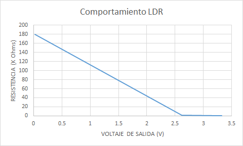

## Introducción

## :trophy: A.1.2 Actividad de aprendizaje

## Objetivo

Realizar un sensor medidor de luz (lux) a través de un circuito electrónico, utilizando un simulador, y  un **LDR (Light dependent Resistor)**.

### :blue_book: Instrucciones

- Se sugiere para el desarrollado de la presenta actividad, utilice uno de los siguientes simuladores: [Autodesk Tinkercad](https://www.tinkercad.com/), [Virtual BreadBoard](http://www.virtualbreadboard.com/), [Easy EDA](https://easyeda.com/) por lo cual habrá que familiarizarse antes, e incluso instalarse o registrarse dentro de la plataforma.
- Toda actividad o reto se deberá realizar, utilizando el estilo **MarkDown con extension .md** y el entorno de desarrollo VSCode, debiendo ser elaborado como un documento **single page**, es decir si el documento cuanta con imágenes, enlaces o cualquier documento externo debe ser accedido desde etiquetas y enlaces, y debe ser nombrado con la nomenclatura **A1.2_NombreApellido_Equipo.pdf.**
- Es requisito que el .MD contenga una etiqueta del enlace al repositorio de su documento en GITHUB, por ejemplo **Enlace a mi GitHub** y al concluir el reto se deberá subir a github.
- Desde el archivo **.md** exporte un archivo **.pdf** que deberá subirse a classroom dentro de su apartado correspondiente, sirviendo como evidencia de su entrega, ya que siendo la plataforma **oficial** aquí se recibirá la calificación de su actividad.
- Considerando que el archivo .PDF, el cual fue obtenido desde archivo .MD, ambos deben ser idénticos.
- Su repositorio ademas de que debe contar con un archivo **readme**.md dentro de su directorio raíz, con la información como datos del estudiante, equipo de trabajo, materia, carrera, datos del asesor, e incluso logotipo o imágenes, debe tener un apartado de contenidos o indice, los cuales realmente son ligas o **enlaces a sus documentos .md**, _evite utilizar texto_ para indicar enlaces internos o externo.
- Se propone una estructura tal como esta indicada abajo, sin embargo puede utilizarse cualquier otra que le apoye para organizar su repositorio.
  
```
- readme.md
  - blog
    - C0.1_x.md
    - C0.2_x.md
  - img
  - docs
    - A0.1_x.md
    - A0.2_x.md
    - A1.2_x.md
    - A1.3_x.md
```


### :pencil2: Desarrollo

1. Utilice el siguiente listado de materiales para la elaboración de la actividad y agregue en la columna Fuente de consulta su enlace _bibliográfico_.

    | Cantidad | Descripción                      | Fuente de consulta |
    | -------- | -------------------------------- | ------------------ |
    | 1        | Sensor Fotoresistencia LDR de 2M | [Geekbot electronics](http://www.geekbotelectronics.com/producto/fotoresistencia-gl5537-2mohm/)  <br> [Datasheet](https://datasheetspdf.com/pdf-file/756864/CdS/GL5537-1/1)|
    | 1        | Resistencia 1k                   |[Digship](https://www.digchip.com/datasheets/parts/datasheet/1838/CFR-25JB-1K0.php)<br>[Datasheet](https://www.digchip.com/datasheets/parts/datasheet/1838/CFR-25JB-1K0-pdf.php)|
    | 1        | Fuente de alimentación de 5v.    |    [homedepot](https://www.homedepot.com.mx/seguridad/baterias-y-pilas/baterias-alcalinas-9v-defiant-2-piezas-121591)<br>[steren](https://www.steren.com.mx/regulador-de-voltaje-positivo-5v-1a.html)                |

2. Considerando que el elemento LDR es un sensor fotoresistivo es decir varia su resistencia en base a la cantidad de luz que incide sobre el, **Que observa en el grafico siguiente?** 
<br>
    > Logramos observar que la fotorresistencia tiene una menor resistencia cuando se expone a una gran cantidad de luz, y viceversa, ya que en el grafico se muestra que a 1000 Lux (unidad de medida de la luminosidad) el LDR tendria una resistencia aproximada de 10 Ohms, mientras que cuando se expone la resistencia a una minima cantidad de luz, presenta una resistencia de 10^6 Ohms.
   
<p align="center">
    
</p>

3. Ensamble el circuito que se muestra utilizado el simulador que halla considerado, colocando la fotorresistencia en la posición LDR y resistencia de acuerdo con la imagen del esquemático:

<p align="center"> 
    
</p>

4. Coloque la imagen finalmente obtenida del circuito ensamblado dentro de su simulador.

    

5. Mida la **resistencia** de la fotorresistencia con el ohmetro bajo las siguientes condiciones: ausencia de luz u oscuridad,  luz ambiente, luz intensiva y registre en la tabla correspondiente.
6. Calcule el **valor de voltaje Vout teórico** para cada una de las condiciones antes indicadas asi como el valor de voltaje Vout medido  y registre en la tabla correspondiente.
7. Calcule el **valor de exactitud** de voltaje entre lo teórico y lo medido para cada condición  y registre en la tabla correspondiente.
<br> 
    - **Desarrollo:**

    

    <!-- |Condicion: Ausencia de luz|Condicion: Luz ambiental| Condicion: Luz intensa|
    |------|-------|------|
    |$V_{out} = \frac{R1*Vin}{R1+R2}$<br>$V_{in} = 5V$<br>$R_{1} = 1kΩ$<br>$R_{2} = 180kΩ$<br>$V_{out} = \frac{1kΩ*5V}{1kΩ+180kΩ}$<br>$V_{out} = \frac{5000ΩV}{181kΩ}$<br>$V_{out} = 0.027V$<br>$Porcentaje = {\frac{V_{out-medido}}{V_{out-teórico}}}*100$ <br>$Porcentaje = {\frac{27.7mV}{27.7mV}}*100$<br>$Porcentaje = 100$%|$V_{out} = \frac{R1*Vin}{R1+R2}$<br>$V_{in} = 5V$<br>$R_{1} = 1kΩ$<br>$R_{2} = 912Ω$<br>$V_{out} = \frac{1kΩ*5V}{1kΩ+912Ω}$<br>$V_{out} = \frac{5000ΩV}{1912Ω}$<br>$V_{out} = 2.615V$<br>$Porcentaje = {\frac{V_{out-medido}}{V_{out-teórico}}}*100$ <br>$Porcentaje = {\frac{2.61V}{2.615V}}*100$ <br>$Porcentaje = 99.8$%|$V_{out} = \frac{R1*Vin}{R1+R2}$<br>$V_{in} = 5V$<br>$R_{1} = 1kΩ$<br>$R_{2} = 506Ω$<br>$V_{out} = \frac{1kΩ*5V}{1kΩ+506Ω}$<br>$V_{out} = \frac{5000ΩV}{1506Ω}$<br>$V_{out} = 3.320V$<br>$Porcentaje = {\frac{V_{out-medido}}{V_{out-teórico}}}*100$ <br>$Porcentaje = {\frac{3.320V}{3.32V}}*100$ <br>$Porcentaje = 100$%| -->


    | Condicion          |  Impedancia en fotoresistencia | Voltaje Vout teórico | Voltaje Vout medido | %  V.Medido/ V.Teórico |
    | --------------- | ----------------------------- | -------------------- | ------------------- | ---------------------- |
    | Ausencia de luz |  *180 kOhms*  |         *0.027 V = 27.7 mV*              | *27.7 mV*  |            *100%*           |
    | Luz ambiental   |  *~912 Ohms*  |          *~2.615 V**             | *~2.61 V*   |        *99.8%*               |
    | Luz intensa     |  *506 Ohms*   |          *3.320 V*             | *3.32 V*   |             *100%*          |

8. **Grafique** a través de los valores registrados en la tabla anterior de tal manera que se pueda observar el comportamiento de la curva del componente LDR e **inserte la grafica**.

    

9. Inserte imágenes de **evidencias** tales como son reuniones  de los integrantes del equipo realizadas para el desarrollo de la actividad.

    
    
    

10.  Incluya las conclusiones individuales y resultados observados durante el desarrollo de la actividad.

- *Morgado Jacome Eduardo*

    > Gracias a la actividad realizada me pude percatar de la forma correcta en que se debe medir la resistencia y el voltaje de un componente electronico en un circuito. De igual manera logre entender como es que funcionan algunos objetos de la vida diaria que usan fotorresistencias como las lamparas solares de los jardines, que cuando no detectan luz activan la bateria y la lampara.
    Tambien, ahora entiendo el amplio y benefico uso de un divisor de voltaje para poder controlar el voltaje deseado a utilizar, ya sea para futuras practicas o posiblemente mi vida laboral.

- *Perales Niebla Abner Jesus*

    >Al incio del trabajo tuve que buscar sobre las fuentes de alimentación de 5v, al principio iba a incluir una fuente de poder de dimensiones casi iguales a la de un protoboard, después mis compañeros propusieron utilizar un regulador de voltaje a 5v, además recordé que algunos compañeros pensaban utilizar un arduino. Esto me enseñó que es muy importante conocer toda la variedad de opciones que se pueden utilizar para cumplir ciertas funciones, y que, aunque todas funcionen, existen algunas más óptimas que otras, quizá por comodidad, por costo u otra razón.

- *Cruz Vera Elden Humberto*

    > Durante la realización de la práctica se tuvo un pequeño problema para utilizar el voltaje de entrada adecuado de 5v, ya que se desconocía una manera fácil de regular el voltaje. Por fortuna, se indago un poco sobre el circuito integrado LM7805 lo cual permitió que la práctica se realizara de la manera adecuada.


### :bomb: Rubrica

| Criterios     | Descripción                                                                                  | Puntaje |
| ------------- | -------------------------------------------------------------------------------------------- | ------- |
| Instrucciones | Se cumple con cada uno de los puntos indicados dentro del apartado Instrucciones?            | 10      |  | 5 |
| Desarrollo    | Se respondió a cada uno de los puntos solicitados dentro del desarrollo de la actividad?     | 60      |
| Demostración  | El alumno se presenta durante la explicación de la funcionalidad de la actividad?            | 20      |
| Conclusiones  | Se incluye una opinión personal de la actividad  por cada uno de los integrantes del equipo? | 10      |

:house: [Ir a inicio](../readme.md)

##### :open_file_folder: [Repositorio de Github de Morgado Jacome Eduardo](https://github.com/EduardoMJ99/SistemasProgramables_2020-2.git) :open_file_folder:
##### :open_file_folder: [Repositorio de Github de Cruz Vera Elden Humberto](https://github.com/CruzVeraEldenHumberto/Sistemas-Programables) :open_file_folder:
##### :open_file_folder: [Repositorio de Github de Perales Niebla Abner Jesús](https://github.com/AbnerPerales19/SistemasProgramables_AbnerPerales.git) :open_file_folder: