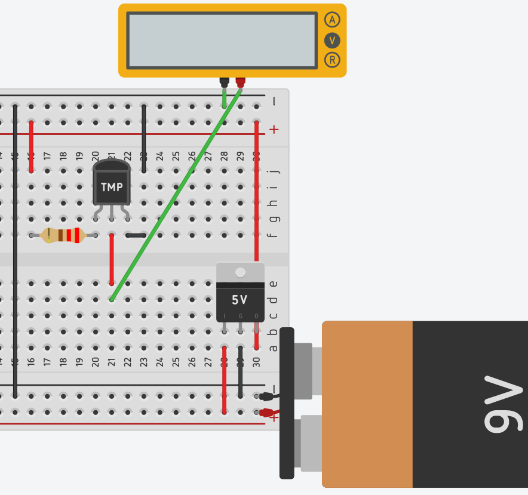
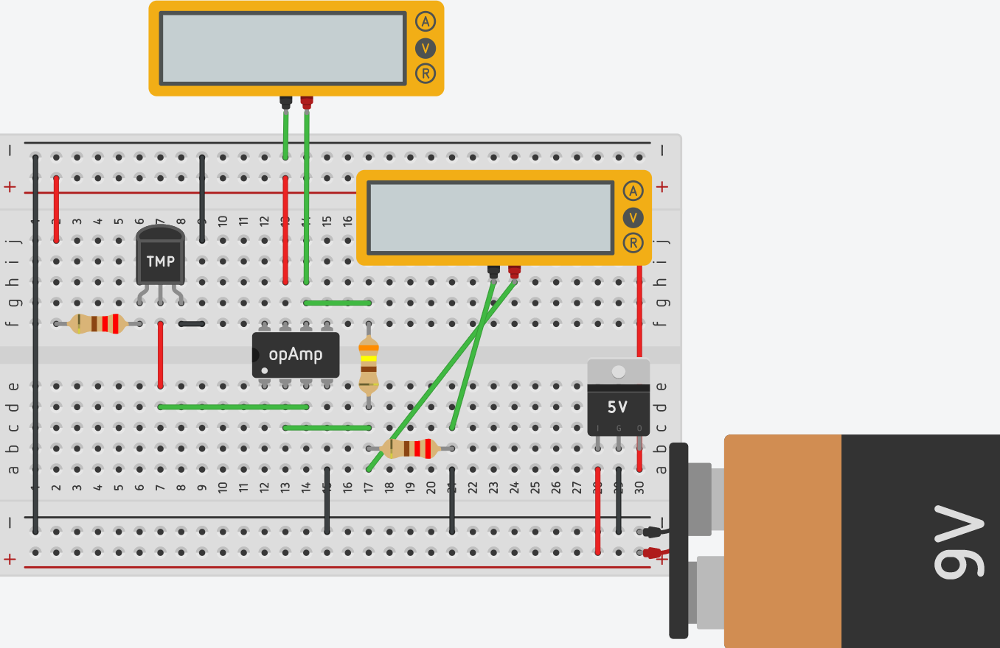
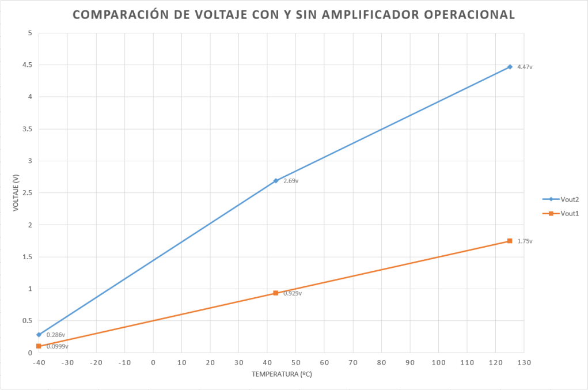
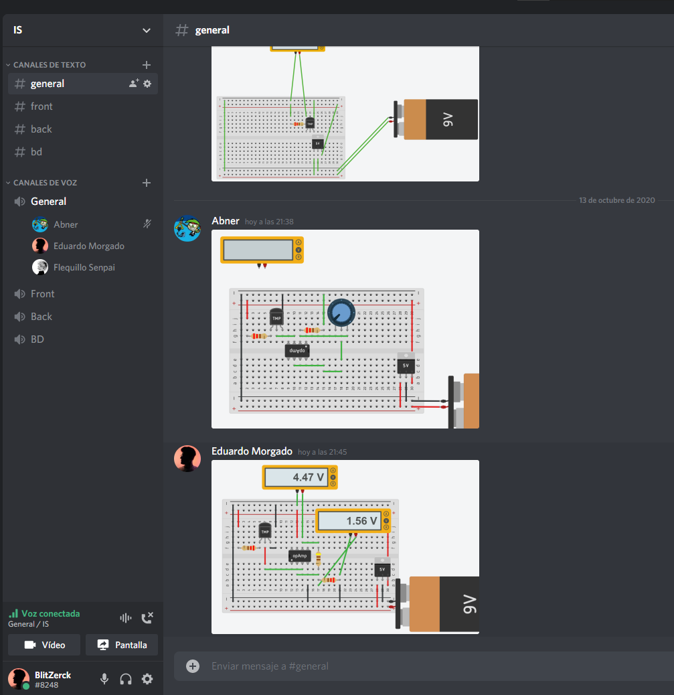
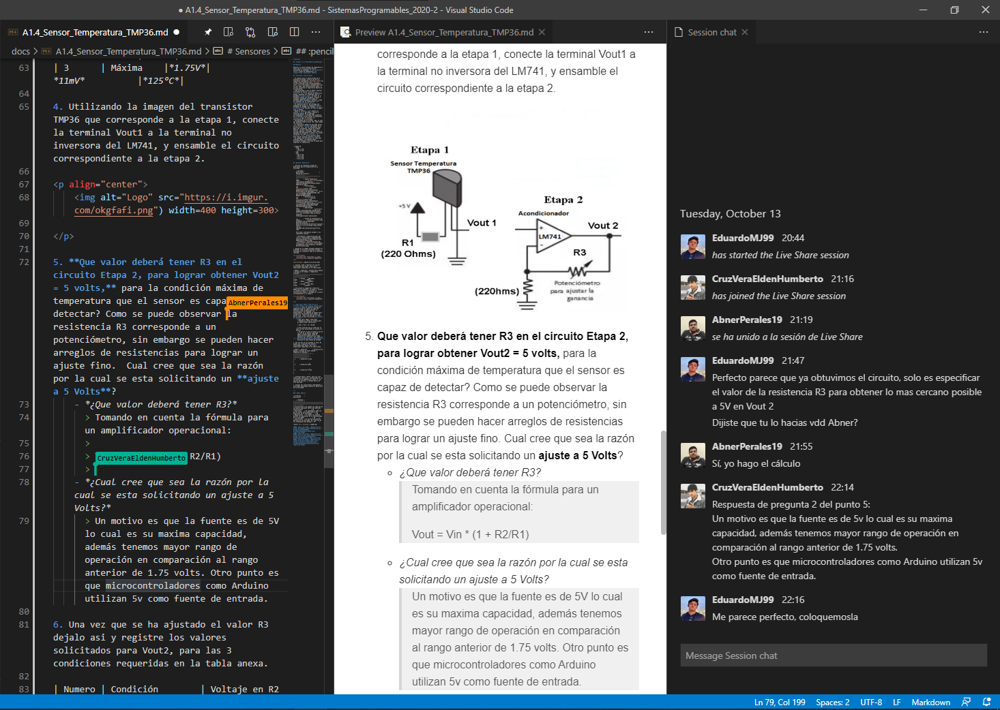

# Sensores

## :trophy: A.1.4 Actividad de aprendizaje

## Objetivo

Realizar un sensor medidor de temperatura a través de un circuito electrónico, utilizando un simulador, y  un **Transistor TMP36** lineal de temperatura y un **amplificador operacional LM741**.

## :blue_book: Instrucciones

- Se sugiere para el desarrollado de la presenta actividad, utilice uno de los siguientes simuladores: [Autodesk Tinkercad](https://www.tinkercad.com/), [Virtual BreadBoard](http://www.virtualbreadboard.com/), [Easy EDA](https://easyeda.com/) por lo cual habrá que familiarizarse antes, e incluso instalarse o registrarse dentro de la plataforma.
- Toda actividad o reto se deberá realizar utilizando el estilo **MarkDown con extension .md** y el entorno de desarrollo VSCode, debiendo ser elaborado como un documento **single page**, es decir si el documento cuanta con imágenes, enlaces o cualquier documento externo debe ser accedido desde etiquetas y enlaces, y debe ser nombrado con la nomenclatura **A1.4_NombreApellido_Equipo.pdf.**
- Es requisito que el .md contenga una etiqueta del enlace al repositorio de su documento en GITHUB, por ejemplo **Enlace a mi GitHub** y al concluir el reto se deberá subir a github.
- Desde el archivo **.md** exporte un archivo **.pdf** que deberá subirse a classroom dentro de su apartado correspondiente, sirviendo como evidencia de su entrega, ya que siendo la plataforma **oficial** aquí se recibirá la calificación de su actividad.
- Considerando que el archivo .PDF, el cual fue obtenido desde archivo .MD, ambos deben ser idénticos.
- Su repositorio ademas de que debe contar con un archivo **readme**.md dentro de su directorio raíz, con la información como datos del estudiante, equipo de trabajo, materia, carrera, datos del asesor, e incluso logotipo o imágenes, debe tener un apartado de contenidos o indice, los cuales realmente son ligas o **enlaces a sus documentos .md**, _evite utilizar texto_ para indicar enlaces internos o externo.
- Se propone una estructura tal como esta indicada abajo, sin embargo puede utilizarse cualquier otra que le apoye para organizar su repositorio.
  
```
- readme.md
  - blog
    - C0.1_x.md
    - C0.2_x.md
  - img
  - docs
    - A0.1_x.md
    - A0.2_x.md
    - A1.2_x.md
    - A1.3_x.md
```

## :pencil2: Desarrollo

1. Utilice el siguiente listado de materiales para la elaboración de la actividad

    | Cantidad | Descripción                       | Fuente de consulta |
    | -------- | --------------------------------- | ------------------ |
    | 1        | Sensor temperatura TMP36          | [Ficha técnica](https://www.analog.com/media/en/technical-documentation/data-sheets/TMP35_36_37.pdf)|
    | 1        | Potenciómetro 10k                 | [geekbot electronics](http://www.geekbotelectronics.com/producto/potenciometro-de-100-kohm/) <br> [Ficha técnica](https://datasheetspdf.com/pdf-file/866974/ALPHA/RV24AF-10-40R1-B10K/1)  |
    | 2        | Resistencias de 220               |  [geekbot electronics](http://www.geekbotelectronics.com/producto/resistencia-220-kohm-1-w/) <br> [Ficha técnica](https://www.digchip.com/datasheets/parts/datasheet/1838/CFR-25JB-220R-pdf.php)|
    | 1        | Amplificador LM741                |     [datasheet](https://datasheetspdf.com/pdf-file/53980/FairchildSemiconductor/LM741/1) <br> [carrod](https://www.carrod.mx/products/lm741-amplificador-operacional)              |
    | 1        | Fuente de alimentación de 5Volts. |       [homedepot](https://www.homedepot.com.mx/seguridad/baterias-y-pilas/baterias-alcalinas-9v-defiant-2-piezas-121591)<br>[steren](https://www.steren.com.mx/regulador-de-voltaje-positivo-5v-1a.html)                     |

    Para mayor información acceder a los siguientes enlaces:

    - Información y especificaciones del [Sensor TMP36](https://components101.com/sites/default/files/component_pin/TMP36-Sensor-Pinout.png)  
    - Información y especificaciones del [Amplificador operacional LM741](https://ortegamraul.files.wordpress.com/2014/03/741-interno.png)

2. Basado en la imagen ensamble mediante un simulador el circuito electrónico etapa 1, colocando el transistor LM35 en la posición indicada. 

<p align="center">
    
</p>



3. Calcule, mida y registre los valores solicitados para Vout1, bajos las 3 condiciones requeridas en la tabla anexa.

| Numero | Condición | Voltaje Vout1 medido | Voltaje en R1 medido | Temperatura indicada |
| ------ | --------- | -------------------- | -------------------- | -------------------- |
| 1      | Mínima    |*99.9mV*|           *11mV*           |*-40°C*|
| 2      | Media     |*929mV*|            *11mV*          |*43°C*|
| 3      | Máxima    |*1.75V*|            *11mV*          |*125°C*|

4. Utilizando la imagen del transistor TMP36 que corresponde a la etapa 1, conecte la terminal Vout1 a la terminal no inversora del LM741, y ensamble el circuito correspondiente a la etapa 2.

<p align="center">
    

</p>



5. **Que valor deberá tener R3 en el circuito Etapa 2, para lograr obtener Vout2 = 5 volts,** para la condición máxima de temperatura que el sensor es capaz de detectar? Como se puede observar la resistencia R3 corresponde a un potenciómetro, sin embargo se pueden hacer arreglos de resistencias para lograr un ajuste fino.  Cual cree que sea la razón por la cual se esta solicitando un **ajuste a 5 Volts**?
    - *¿Que valor deberá tener R3?*
      > **Tomando en cuenta la fórmula para  un amplificador operacional:**
      > 
      > **Vout = Vin * (1 + R2/R1)**, para los valores **Vin = 1.75V**, **R1 = 220 Ω** y **Vout = 5V** (porque necesitamos el valor ideal de R2 cuando Vout = 5V), tenemos que:
      > 
      > 5V = 1.75V * (1 + R2/220Ω) <br> 5V/1.75V = 1 + R2/220Ω <br> 2.85 - 1 = R2/220 Ω <br> 1.85 = R2/220 <br> 1.85 * 220 = R2 <br> **408.57 Ω = R2** <br>
      
    - *¿Cual cree que sea la razón por la cual se esta solicitando un ajuste a 5 Volts?*
      > Un motivo es que la fuente es de 5V lo cual es su maxima capacidad, además tenemos mayor rango de operación en comparación al rango anterior de 1.75 volts. Otro punto es que microcontroladores como Arduino donde podemos evaluar el comportamiento del sensor, utilizan 5V como fuente de entrada, entonces ampliamos el rango de operacion con el que podemos trabajar.
   
6. Una vez que se ha ajustado el valor R3 dejalo asi y registre los valores solicitados para Vout2, para las 3 condiciones requeridas en la tabla anexa.

**Tomando el valor de R3 calculado (408.57 Ω):**
| Numero | Condición| Voltaje en R2 medido|Voltaje en Vout2 medido|Temperatura indicada|
| ------ | -------- | -------------- | ---------------- | ------------ |
| 1      | Condición mínima | *100mV* | *286mV* | *-40°C* |
| 2      | Condición media  | *940mV* | *2.69V* | *43°C* |
| 3      | Condición máxima | *1.56V* | *4.47V* | *125°C* |


7. Grafique Vout1 y Vout2, para las tres condiciones anteriores, considerando en "X" los valores de temperatura y para "Y" los valores de voltaje, y coloque dentro de este apartado.



8. Inserte imágenes de **evidencias** tales como son reuniones  de los integrantes del equipo realizadas para el desarrollo de la actividad.





9. Incluya las conclusiones individuales y resultados observados durante el desarrollo de la actividad.

- *Morgado Jacome Eduardo*

    > Verdaderamente el mundo de la electronica es muy amplio, desconocia totalmente la existencia y el uso de un amplificador operacional, y veo que es muy util para mejorar el rango de operacion de los sensores y ser mas preciso. Cada vez la idea de utilizar sensores y un microcontrolador en mi hogar para hacer de una casa inteligente es mas claro y cercano. 
    De igual manera el conocer y saber utilizar sus formulas ayuda a evitar errores o dudas sobre la utilizacion del mismo, como por ejemplo el no saber si tomar el valor calculado de una resistencia o guiarse por un simulador, pero en conclusion las matematicas son ciencias exactas, asi que el valor calculado es el ideal.

- *Perales Niebla Abner Jesus*

    > En esta actividad aprendí la verdadera importancia de saber medir bien el voltaje o al menos aprenderse de memoria cómo debe ser. Ya que, al inicio, estábamos midiendo mal el voltaje en la resistencia y eso provocó que los resultados fueran incorrectos. Afortunadamente era un error menor y se corrigió fácilmente. En materias pasadas cuando necesitaba medir el voltaje o la corriente, lo que hacía es siempre ver en internet, pero en vista de esto, me haré una tabla o un escrito donde me explique a mí mismo cómo medir correctamente con el multímetro y porqué, ya que esto facilitará que me lo aprenda de memoria.

- *Cruz Vera Elden Humberto*

    > Me pareció bastante interesante el funcionamiento del amplificador operacional, ya que en el cálculo realizado para convertir los 1.75 volts a 5volts se necesita una resistencia de 408.57 ohms, pero esto solo sería en un caso ideal debido a que hay una caída de tensión gracias al mismo amplificador. Se tuvo una duda relacionada a que resistencia utilizar durante la práctica, pero se optó por utilizar la obtenida en el cálculo.
___

### :bomb: Rubrica

| Criterios     | Descripción                                                                                  | Puntaje |
| ------------- | -------------------------------------------------------------------------------------------- | ------- |
| Instrucciones | Se cumple con cada uno de los puntos indicados dentro del apartado Instrucciones?            | 10      |
| Desarrollo    | Se respondió a cada uno de los puntos solicitados dentro del desarrollo de la actividad?     | 60      |
| Demostración  | El alumno se presenta durante la explicación de la funcionalidad de la actividad?            | 20      |
| Conclusiones  | Se incluye una opinión personal de la actividad  por cada uno de los integrantes del equipo? | 10      |

:house: [Ir a inicio](../readme.md)

##### :open_file_folder: [Repositorio de Github de Morgado Jacome Eduardo](https://github.com/EduardoMJ99/SistemasProgramables_2020-2.git) :open_file_folder:
##### :open_file_folder: [Repositorio de Github de Cruz Vera Elden Humberto](https://github.com/CruzVeraEldenHumberto/Sistemas-Programables) :open_file_folder:
##### :open_file_folder: [Repositorio de Github de Perales Niebla Abner Jesús](https://github.com/AbnerPerales19/SistemasProgramables_AbnerPerales.git) :open_file_folder: