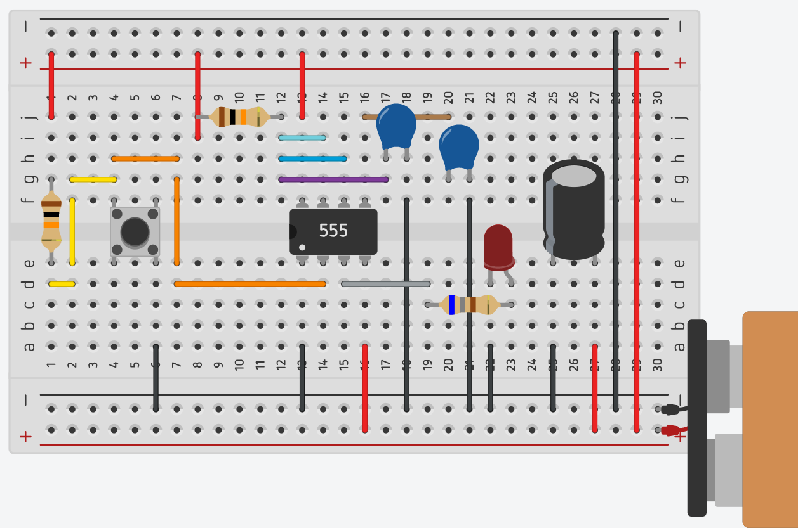
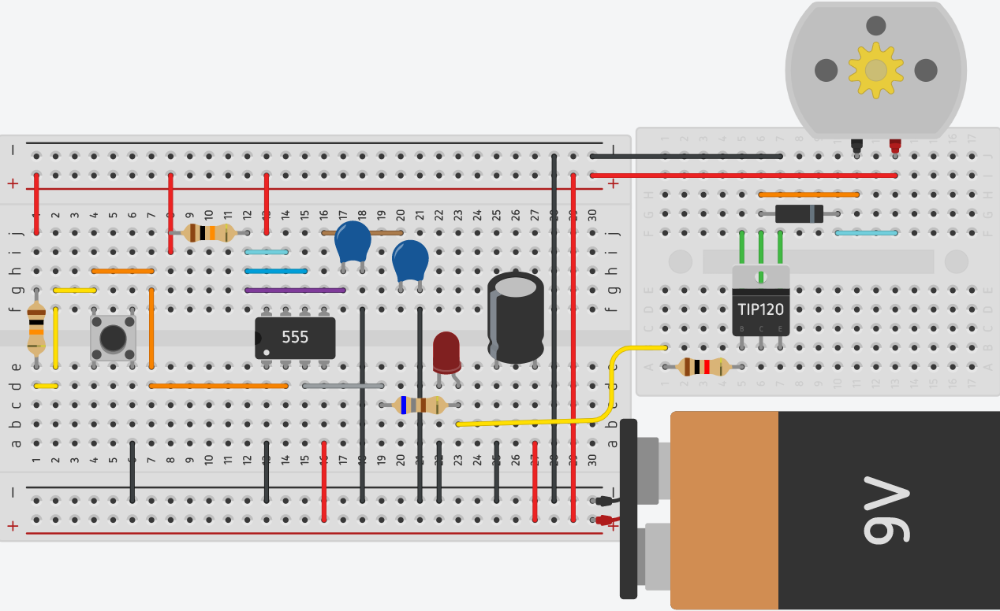
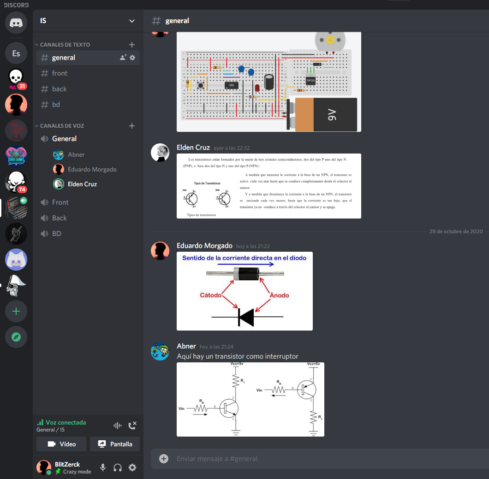

# Actuadores

# :trophy: A.2.2 Actividad de aprendizaje

 Realizar un sistema de control de arranque y encendido para un actuador eléctrico a través de un circuito electrónico, utilizando un simulador, un **Temporizador NE55s** y un **Motor de DC**.


### :blue_book: Instrucciones

- Se sugiere para el desarrollado de la presenta actividad, utilice uno de los siguientes simuladores: [Autodesk Tinkercad](https://www.tinkercad.com/), [Virtual BreadBoard](http://www.virtualbreadboard.com/), [Easy EDA](https://easyeda.com/) por lo cual habrá que familiarizarse antes, e incluso instalarse o registrarse dentro de la plataforma.
- Toda actividad o reto se deberá realizar utilizando el estilo **MarkDown con extension .md** y el entorno de desarrollo VSCode, debiendo ser elaborado como un documento **single page**, es decir si el documento cuanta con imágenes, enlaces o cualquier documento externo debe ser accedido desde etiquetas y enlaces, y debe ser nombrado con la nomenclatura **A2.2_NombreApellido_Equipo.pdf.**
- Es requisito que el .md contenga una etiqueta del enlace al repositorio de su documento en GITHUB, por ejemplo **Enlace a mi GitHub** y al concluir el reto se deberá subir a github.
- Desde el archivo **.md** exporte un archivo **.pdf** que deberá subirse a classroom dentro de su apartado correspondiente, sirviendo como evidencia de su entrega, ya que siendo la plataforma **oficial** aquí se recibirá la calificación de su actividad.
- Considerando que el archivo .PDF, el cual fue obtenido desde archivo .MD, ambos deben ser idénticos.
- Su repositorio ademas de que debe contar con un archivo **readme**.md dentro de su directorio raíz, con la información como datos del estudiante, equipo de trabajo, materia, carrera, datos del asesor, e incluso logotipo o imágenes, debe tener un apartado de contenidos o indice, los cuales realmente son ligas o **enlaces a sus documentos .md**, _evite utilizar texto_ para indicar enlaces internos o externo.
- Se propone una estructura tal como esta indicada abajo, sin embargo puede utilizarse cualquier otra que le apoye para organizar su repositorio.
  
```
- readme.md
  - blog
    - C2.1_x.md
    - C2.2_x.md
  - img
  - docs
    - A2.1_x.md
    - A2.2_x.md
```
### :pencil2: Desarrollo

1.Utilice el siguiente listado de materiales para la elaboración de la actividad

| Cantidad | Descripción                            | Fuente de consulta |
| -------- | -------------------------------------- | ------------------- |
| 1        | Circuito integrado LM555               | [Mecatronicalatam](https://www.mecatronicalatam.com/es/tutoriales/electronica/componentes-electronicos/555/) <br> [Datasheet](https://pdf1.alldatasheet.es/datasheet-pdf/view/53587/FAIRCHILD/LM555.html) |
| 1        | Capacitor electrolítico de 47uf        | [Multicomp](https://www.melopero.com/datasheets/47uF.pdf) |
| 1        | Condensador cerámico de 10nf           | [Vishay](https://www.mouser.com/datasheet/2/427/561r562r565r-1762556.pdf) |
| 1        | Fuente de voltaje de 9V                | [Truper](https://www.truper.com/ficha_merca/ficha-print.php?code=46319) |
| 1        | Transistor de poder TIP122             | [SandoRobotics](https://sandorobotics.com/producto/tip122/) <br> [Datasheet](https://pdf1.alldatasheet.es/datasheet-pdf/view/2770/MOSPEC/TIP122.html)  |
| 1        | Diodo 1N4001 o equivalente             | [330ohms](https://www.330ohms.com/products/diodo-rectificador-1n4001) <br> [Datasheet](https://pdf1.alldatasheet.es/datasheet-pdf/view/190206/WTE/1N4001.html) |
| 1        | Mini Motor DC                          | [Mercado libre](https://articulo.mercadolibre.com.mx/MLM-787017272-mini-motor-dc-3-a-6v-proyectos-electronica-arduino-10-piezas-_JM#position=1&type=item&tracking_id=c7c72f38-5216-4942-a4f7-c2f78de68d31) |
| 3        | Resistencias 680,1k,10k Ohmios de 1/4w | [Electronica Plug and Play, 480 ohms](https://www.electronicaplugandplay.com/componentes-pasivos/resistencias/resistencias-de-carbon/product/82-resistencia-680-1-4-watt) |
| 1        | Pulsador de disparo                    | [Mercado libre](https://articulo.mercadolibre.com.mx/MLM-776382581-50-pzas-push-boton-microswitch-de-2-o-4-pines-elegir-_JM#position=23&type=item&tracking_id=74e71232-b608-47cf-9f03-dc81504bf448) |
| 1        | Diodo Led Rojo                         | [Geekbot Electronics](http://www.geekbotelectronics.com/producto/led-difuso-rojo-5-mm/) |

2. Utilice el circuito electrónico de la imagen siguiente y ensamble la etapa 1 dentro del simulador.

<p align="center">
    
</p>



3. Como se podrá observar en el circuito anterior existe un area identificada como "Red de tiempo" y otra "Filtro de desacople", **explique el proposito de ambos terminologias**.

    > **Red de tiempo:** Esta sección o área está compuesta por una resistencia y un capacitor, los cuales están conectados a las terminales 6 y 7 del Temporizador. En base a esta resistencia y capacitor se define la constante de tiempo, con la fórmula **Ct = 1.1 * R1 * C1**. Entre mayor sean estos componentes, mayor será la constante de tiempo.<br> 

    > **Filtro de desacople:** Este filtro funciona en base a un condensador o capacitor de desacoplo, el cual se encarga de desacoplar las señales de CA (que normalmente obtenemos de una fuente de alimentacion) de una señal CC. En otras palabras, nos permite limpiar el ruido de una señal de CA y nos transmite una señal de CC. Como vemos, este filtro se encuentra en las entradas de voltaje para lograr su objetivo de limpiar la señal. <br> 


4. Continuando con la imagen anterior, observe se muestra la ecuación Ct= 1.1 * R1 * C1, la cual es utilizada para establecer el tiempo de **encendido del pulso de salida**. Basándose en esa ecuación anterior calcule los valores de **R1 y C1** si se desea mantener encendido el pulso de salida, dada las 3 condiciones requeridas en la tabla anexa.

    > Tomando en cuenta que es un circuito monoestable y que la formula dada es: <br>Ct = 1.1 * R1 * C1 
    <br> donde **Ct** = tiempo de la señal en s, <br> **R** es el valor de la resistencia en Ω y <br> **C** es el valor del capacitor en faradays.
    <br>Se tiene que despejar la formula anterior para poder obtener los valores de R1 y C1, por lo cual se obtiene la siguiente formula.
    <br>R1 * C1 = Ct/1.1
    <br>Se tiene que encontrar una resistencia y un capacitor donde su producto de el resultado de cada una de las 3 condiciones de la tabla.
    <br>Se tomará como valor fijo una resistencia comercial de 470uf y se despejará R1 de la formula.
    <br>R1 = 3s/(0.00047uF * 1.1)
    <br>R1 = 5.802kΩ  
        R1 = 5s/(0.00047uF * 1.1)
    <br>R1 = 9.671kΩ 
    <br>R1 = 8s/(0.00047uF * 1.1)
    <br>R1 = 15.473kΩ 
    <br>Dados los resultados anteriores, si se desean utilizar resistencias comerciales, podriamos utilizar las siguientes para cada condición:
    <br>R1 Condición 1: 5.6kΩ
    <br>R1 Condición 2: 10kΩ
    <br>R1 Condición 3: 15kΩ


    | Numero | Condición  | Valor de R1 | Valor de C1 |
    | ------ | ---------- | ----------- | ----------- |
    | 1      | 3 segundos | 5.6kΩ      |470uF         |
    | 2      | 5 segundos | 10kΩ    |470uF           |
    | 3      | 8 segundos |15kΩ     |470uF            |

5. Una vez que se halla completado la tabla anterior, inicie la simulación para cualquiera de las tres condiciones y observe el comportamiento del Led;  **explique su observación**.

    > Analizando la simulación de la primera etapa tomando la condición 2, se puede observar que al inicio de esta se encendía el led un tiempo determinado (aproximademente 5 segundos) y despues de ello se apagaba. Al accionar el botón, el led se encendía por otros 5 segundos.

6. Ensamble la etapa 2 e integre la terminal del pulso de salida a la entrada de la base del transistor de esta segunda etapa.



7. Una vez concluido el paso anterior, elija una de las 3 condiciones registradas en la tabla anterior y observe el comportamiento del motor DC; **explique su observación**.
    
    > Una vez finalizada y simulada la etapa 2, se puede observar que el motor de corriente continua se enciende y entra en funcionamiento la misma cantidad de tiempo que esta encendido el LED, que se encienden en funcion del pulso de salida del LM555 y que al mismo tiempo este tiempo esta en funcion de la red de tiempo de la etapa 1.

8. Una vez que el tiempo de encendido del pulso de salida de la etapa 1 se completo, **que sucede con el motor DC? Explique la razon de este comportamiento?**

    > Una vez que la corriente sale de la etapa 1, pasa por la resistencia y llega a la Base del transistor, esta terminal se exita con la corriente y conecta el emisor con el colector (el emisor está recibiendo corriente negativa del circuito), por lo que el colector pasa la corriente negativa a la terminal 1 del motor, cerrando el circuito. Por consecuencia el motor, que ya tenía corriente positiva, recibe la corriente negativa y se activa, solo durante el tiempo que la etapa 1 proporcione corriente al transistor.

9. Inserte imágenes de **evidencias** tales como son reuniones  de los integrantes del equipo realizadas para el desarrollo de la actividad.




10. Incluya las conclusiones individuales y resultados observados durante el desarrollo de la actividad.

- *Morgado Jacome Eduardo*

    > Claro esta que cuando uno mismo realiza las actividades queda mas claro todo, ya que, entendia el funcionamiento del LM555 con la teoria, pero despues de la practica entendi ahora mejor los usos que tiene este circuito integrado. Otro concepto claro fue el uso de el transistor y el diodo, ya que en un principio creia que estos eran realmente innecesarios para el funcionamiento del motor, pero una vez entendida la razon del comportamiento de este, me doy cuenta de una vez por todas el funcionamiento de un transistor y su cantidad de usos, ademas de su importancia para esta practica. Lo primero que se me viene a la mente para un uso practico de este tipo de circuito realizado, es para la automatizacion de la abertura de una puerta en un cierto intervalo de tiempo en funcion de algun sensor.

- *Perales Niebla Abner Jesus*

    > Anteriormente, en otras materias, ya había utilizado transistores, diodos rectificadores y motores. Sin embargo, a pesar de que había armado pequeños circuitos, en realidad no entendía muy bien su función ni como pueden interactuar entre ellos. Al inicio nos preguntábamos el por qué usabamos tanto el diodo como el transitor, luego nos dimos cuenta que el transistor era como un interruptor que permitía cerrar el circuito para que el motor funcionara, lo cual es interesante por que esto me deja claro que siempre se necesita energía positiva y negativa para que los circuitos funcionen, algo que ya sabía pero no entendía teóricamente pero que no tenía presente. Y nos sorprendió saber que el diodo rectificador tenía la función de evitar que el motor gire en sentido inverso.

- *Cruz Vera Elden Humberto*

    > Me pareció bastante interesante la práctica, en particular el apartado de la etapa 2. Lo primero fue que en la vida real el motor tiene que tener un retroceso cuando este deja de tener corriente, lo curioso es que en la simulación realizada por nuestro equipo no se pudo observar el retroceso. Incluso por más acertado que sea un simulador, a veces este tendrá pequeñas diferencias en comparación a que si se realizara una práctica con hardware real. Otro detalle que me llamo la atención de la etapa 2 fue el uso del transistor, ya que a simple viste yo pensaba que no hacía mucho, hasta que pude reflexionar en su propósito, el cual permite que se pueda cerrar el circuito cuando la base del mismo transistor se excita y permite que la corriente fluya entre colector y emisor.

### :bomb: Rubrica

| Criterios     | Descripción                                                                                  | Puntaje |
| ------------- | -------------------------------------------------------------------------------------------- | ------- |
| Instrucciones | Se cumple con cada uno de los puntos indicados dentro del apartado Instrucciones?            | 10      |
| Desarrollo    | Se respondió a cada uno de los puntos solicitados dentro del desarrollo de la actividad?     | 60      |
| Demostración  | El alumno se presenta durante la explicación de la funcionalidad de la actividad?            | 20      |
| Conclusiones  | Se incluye una opinión personal de la actividad  por cada uno de los integrantes del equipo? | 10      |


:house: [Ir a inicio](../readme.md)

##### :open_file_folder: [Repositorio de Github de Morgado Jacome Eduardo](https://github.com/EduardoMJ99/SistemasProgramables_2020-2.git) :open_file_folder:
##### :open_file_folder: [Repositorio de Github de Cruz Vera Elden Humberto](https://github.com/CruzVeraEldenHumberto/Sistemas-Programables) :open_file_folder:
##### :open_file_folder: [Repositorio de Github de Perales Niebla Abner Jesús](https://github.com/AbnerPerales19/SistemasProgramables_AbnerPerales.git) :open_file_folder: