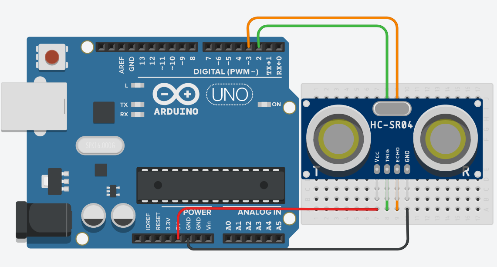
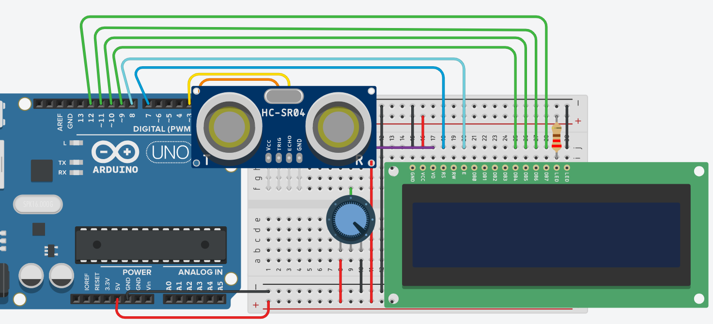
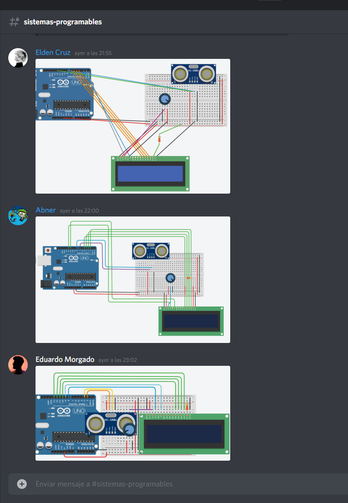
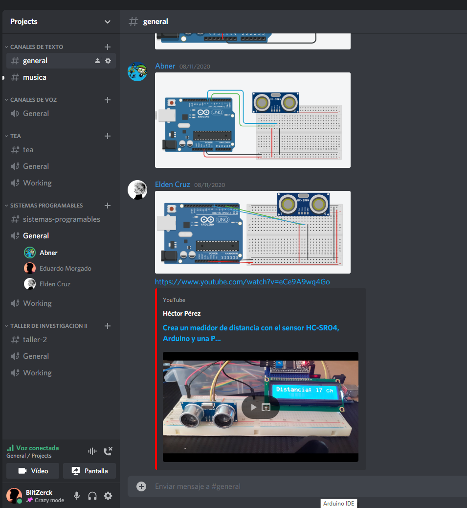

# :trophy: A.3.1 Actividad de aprendizaje

Circuito sensor de detección de objetos, utilizando un Arduino, un sensor ultrasonico y un Display I2C LCD 16x2.
___

## Instrucciones

* Realizar un sistema simulado, capaz de detectar la presencia y/o ausencia de un objeto, a través de un circuito electrónico, utilizando un Arduino, y un **Sensor Ultrasonico HC-SR04**.
* Toda actividad o reto se deberá realizar utilizando el estilo **MarkDown con extension .md** y el entorno de desarrollo VSCode, debiendo ser elaborado como un documento **single page**, es decir si el documento cuanta con imágenes, enlaces o cualquier documento externo debe ser accedido desde etiquetas y enlaces, y debe ser nombrado con la nomenclatura **A3.1_NombreApellido_Equipo.pdf.**
* Es requisito que el .md contenga una etiqueta del enlace al repositorio de su documento en GITHUB, por ejemplo **Enlace a mi GitHub** y al concluir el reto se deberá subir a github.
* Desde el archivo **.md** exporte un archivo **.pdf** que deberá subirse a classroom dentro de su apartado correspondiente, sirviendo como evidencia de su entrega, ya que siendo la plataforma **oficial** aquí se recibirá la calificación de su actividad.
* Considerando que el archivo .PDF, el cual fue obtenido desde archivo .MD, ambos deben ser idénticos.
* Su repositorio ademas de que debe contar con un archivo **readme**.md dentro de su directorio raíz, con la información como datos del estudiante, equipo de trabajo, materia, carrera, datos del asesor, e incluso logotipo o imágenes, debe tener un apartado de contenidos o indice, los cuales realmente son ligas o **enlaces a sus documentos .md**, _evite utilizar texto_ para indicar enlaces internos o externo.
* Se propone una estructura tal como esta indicada abajo, sin embargo puede utilizarse cualquier otra que le apoye para organizar su repositorio.
  
```
* readme.md
  - blog
    - C3.1_TituloActividad.md
    - C3.2_TituloActividad.md
    - C3.3_TituloActividad.md
    - C3.4_TituloActividad.md
    - C3.5_TituloActividad.md
    - C3.6_TituloActividad.md
    - C3.7_TituloActividad.md
    - C3.8_TituloActividad.md
  - img
  - docs
    - A3.1_TituloActividad.md
    - A3.2_TituloActividad.md
    - A3.3_TituloActividad.md
```
___

## Desarrollo

1. Utilizar el siguiente listado de materiales para la elaboración de la actividad

| Cantidad | Descripción                                                                                                                                                                                                                        |
| -------- | ---------------------------------------------------------------------------------------------------------------------------------------------------------------------------------------------------------------------------------- |
| 1        | Sensor [Ultrasonico HC-SR04](https://www.amazon.com.mx/SainSmart-HC-SR04-Ranging-Detector-Distance/dp/B004U8TOE6/ref=sr_1_5?__mk_es_MX=%C3%85M%C3%85%C5%BD%C3%95%C3%91&dchild=1&keywords=hc-sr04&qid=1599005012&sr=8-5)            |
| 1         | [Display LCD de 16x2](https://www.winstar.com.tw/es/products/character-lcd-display-module/16x2-datasheet.html)
| 1        | [Fuente de voltaje de 5V](https://www.amazon.com.mx/Progressive-Automations-LC-066-Arduino-Rev3/dp/B00WH5XOJK/ref=sr_1_7?__mk_es_MX=%C3%85M%C3%85%C5%BD%C3%95%C3%91&dchild=1&keywords=arduino+uno&qid=1599005073&sr=8-7)    |
| 1        | [1 Potenciómetro 10k ](https://www.amazon.com.mx/Uxcell-a15011600ux0235-Linear-Rotary-Potentiometer/dp/B01DKCUVMQ/ref=sr_1_1?__mk_es_MX=%C3%85M%C3%85%C5%BD%C3%95%C3%91&dchild=1&keywords=potenciometro+10k&qid=1599005041&sr=8-1) |
| 1        | [Arduino UNO](https://www.amazon.com.mx/Progressive-Automations-LC-066-Arduino-Rev3/dp/B00WH5XOJK/ref=sr_1_7?__mk_es_MX=%C3%85M%C3%85%C5%BD%C3%95%C3%91&dchild=1&keywords=arduino+uno&qid=1599005073&sr=8-7)                       |

2. Basado en la imágen que se muestra, ensamble dentro del simulador a utilizar, el circuito electrónico indicado en la **Figura 1**.

<p align="center"> 
    <strong>Figura 1 Sensor Ultrasonico</strong>
    
</p>



3. Realice el programa que permita a través de una de las entradas del Arduino, recibir el valor que registra el **Sensor Ultrasonico** al acercarse un objeto a distintas distancias.

```
//Declaracion de variables
const int trigPin= 2;
const int echoPin = 3;
float distancia;
int duracion;

void setup() {
  //Se colocan los modos que tendran los pines.
  pinMode(trigPin, OUTPUT);
  pinMode(echoPin, INPUT);
  Serial.begin(9600);
}
void loop() {
  //Inicialmente, se coloca el pin de disparo en LOW
  //para iniciar a calcular el valor de distancia.
  digitalWrite(trigPin,LOW); 
  delayMicroseconds(2);
  
  //Como indica las especificaciones, para iniciar
  //la onda ultrasonica y que la reciba se necesitan
  //al menos 10us de encendido del pin de disparo.
  digitalWrite(trigPin, HIGH);
  delayMicroseconds(10);
  digitalWrite(trigPin, LOW);
  
  //Una vez enviada la onda, el pin ECHO recibe dicha onda
  //en un determinado tiempo.
  //pulseIn nos ayuda a determinar el tiempo que tarda en
  //pasar de LOW a HIGH el pin de echo.
  duracion = pulseIn(echoPin, HIGH);
  
  //Se calcula la distancia con su formula de D = V*t
  //y entre 2 ya que solo necesitamos saber la distancia
  //de venida, y no de ida y venida.
  distancia = (duracion*0.034)/2;

  //Se imprime el resultado
  Serial.print("Distancia: "); 
  Serial.print(distancia);
  Serial.println("cm");
}
```

4. Considerando que el sensor ultrasonico tiene un rango mínimo y máximo de detección basado en el tiempo de retorno de la señal sonica, que valores se obtienen en la simulación bajo las **siguientes condiciones:**

| Numero | Condición 1                   | Condición2                                 | El objeto es detectado? |
| ------ | ----------------------------- | ------------------------------------------ | ----------------------- |
| 1      | 5 cm de distancia al sensor   | 0 grados al eje perpendicular del sensor   | Sí
| 2      | 50 cm de distancia al sensor  | 35 grados al eje perpendicular del sensor  | No
| 3      | 100 cm de distancia al sensor | -35 grados al eje perpendicular del sensor | No
| 4      | 5 cm de distancia al sensor   | 90 grados al eje perpendicular del sensor  | No
| 5      | 50 cm de distancia al sensor  | -60 grados al eje perpendicular del sensor | No
| 6      | 350 cm de distancia al sensor | 0 grados al eje perpendicular del sensor   | No

5. Una vez completados los puntos anteriores, agregue a la Figura 1, **un Display I2C 16x2 LCD**, y coloque la imagen del circuito completado hasta este apartado.



6. Al haber completado la integración del Display I2C, ajuste el programa que le permita a través del display mostrar el siguiente mensaje, **"Objetivo detectado a ? cm** , y en caso de no lograr la detección indicar el mensaje **"Objetivo fuera de rango"**

```
#include <LiquidCrystal.h>

//Declaracion de variables
//Con ayuda de la libreria de Liquid, se declara el LCD
//con los pines que estan conectados en el siguiente orden:
//RS - Enable - D4 - D5 - D6 - D7
LiquidCrystal LCD(7,8,9,10,11,12);

//Variables para el sensor y calcular la distancia.
const int trigPin= 2;
const int echoPin = 3;
float distancia;
int duracion;

void setup() {
  //Se colocan los modos que tendran los pines.
  pinMode(trigPin, OUTPUT);
  pinMode(echoPin, INPUT);
  
  //Se declara la velocidad de transmision del bus serial
  Serial.begin(9600);
  
  //Se inicializa el LCD indicando las dimensiones a utilizar:
  //16x2 pixeles (ancho y alto).
  LCD.begin(16,2);
}
void loop() {
  //Inicialmente, se coloca el pin de disparo en LOW
  //para iniciar a calcular el valor de distancia.
  digitalWrite(trigPin,LOW); 
  delayMicroseconds(2);
  
  //Como indica las especificaciones, para iniciar
  //la onda ultrasonica y que la reciba se necesitan
  //al menos 10us de encendido del pin de disparo.
  digitalWrite(trigPin, HIGH);
  delayMicroseconds(10);
  digitalWrite(trigPin, LOW);
  
  //Una vez enviada la onda, el pin ECHO recibe dicha onda
  //en un determinado tiempo.
  //pulseIn nos ayuda a determinar el tiempo que tarda en
  //pasar de LOW a HIGH el pin de echo.
  duracion = pulseIn(echoPin, HIGH);
  
  //Se calcula la distancia con su formula de D = V*t
  //y entre 2 ya que solo necesitamos saber la distancia
  //de venida, y no de ida y venida.
  distancia = (duracion*0.034)/2;
  
  //Se posiciona el cursor para saber donde iniciar a escribir.
  LCD.setCursor(0,0);
  
  //Si el valor calculado de la distancia esta dentro del rango...
  if(distancia <= 326.5){
    //Se imprime el resultado en el display.
    LCD.print("Objetivo detec-");
    LCD.setCursor(0,1);
    LCD.print("tado a: ");
    LCD.print(distancia);
    LCD.print("cm");
    delay(10);
    Serial.print("Distancia: "); 
  	Serial.print(distancia);
  	Serial.println("cm");
  }
  else{
    //Se imprime fuera de rango.
    LCD.clear();
    LCD.print("Objetivo fuera");
    LCD.setCursor(0,1);
    LCD.print("de rango.");
    delay(10);
    Serial.println("Objetivo fuera de rango.");
  } 
}
```

7. Coloque aqui evidencias que considere importantes durante el desarrollo de la actividad.





8. Incluya las conclusiones individuales y resultados observados durante el desarrollo de la actividad.

- *Morgado Jacome Eduardo*

    > Para la realizacion de la practica, se vio primeramente el como funciona un arduino y las funcionalidades de sus terminales, con lo cual gracias a esto puedo entender perfectamente que el arduino es un kit de desarrollo, y el ATmega328 es el cerebro, el microcontrolador. De igual manera entender que los pines tienen una funcion en especifico, que algunos son solo analogicos, otros digitales y que algunos pueden hacerce salidas PWM. <br> La primera etapa del ejercicio no tuve problema en realizar y entender, ya que las conexiones eran simples y efectivas, al igual que el programa para poder usar el sensor. De esta estapa especificamente al realizar la tabla, teniamos la duda del funcionamiento del sensor, ya que, en sus especificaciones, indica que puede tener un rango de funcionamiento mas grande que el que mostraba el simulador, pero al final se opto por usar los valores simulados. <br> La complicacion de la segunda etapa fue la conexion del display, ya que contiene demasiados pines, pero una vez leido y entendido su funcionamiento, se pudo concretar la conexion, donde lamentablemente se tuvo un problema mas, el cual fue que el display se "quemaba" ya que estaba recibiendo demasiada corriente, pero basto con una resistencia en el lugar indicado para solucionarlo. En general, es de suma importancia leer las especificaciones de los componentes antes de conectarlos, porque en nuestro caso si no hubiera sido el hecho de estar usando un simulador, hubieramos arruinado un display LCD, que hubiera llevado a la compra de uno nuevo, y realmente nadie desea eso.

- *Perales Niebla Abner Jesus*

    > Antes de esta práctica y de esta unidad, creía que los únicos sensores de distancia era de infrarojo, y aún pensando eso, no tenía ni idea de cómo funionaban. Me pareció demasiado interesante el entender el funsionamiento de este sensor, de que lanza una onda ultrasónica y tiene un receptor que recibe el rebote. Otra cosa que me gustó mucho de esta práctica, es que nunca antes había usado arduino, siempre había escuchado a medio mundo mencionar el arduino y que lo programaban y yo jamás lo había hecho, y aunque no sea un arduino real, si estamos aprendiendo sobre su funcionamiento y las cosas que podemos hacer con él. Así mismo, en las materias anteriores no había podido armar un circuito, y en este caso, por cómo se lleva la materia y cómo trabajamos en equipo, me veo obligado a armar los circuitos por mi cuenta y luego comparar con ellos y me doy cuenta que voy mejorando en la comprensión práctica.

- *Cruz Vera Elden Humberto*

    > Algo que me pareció bastante interesante al desarrollar la práctica fue el funcionamiento del sensor ultrasónico en la simulación. En el código realizado se utilizaba un delay de 2 y 10 microsegundos debido a las especificaciones técnicas que tiene el sensor, pero se pudo comprobar que no necesita esos valores exactamente para poder realizar la simulación en Tinkercad.  Esto demuestra que, aunque la simulación sea muy acertada en muchas partes no se compara a realizar la práctica con componentes físicos. <br> Otro detalle es que al realizar el circuito el led y monitor en serie no desplegaban los datos, eso fue debido a que utilicé el pin 1, e indagando en internet vi que no se recomendada utilizar el pin 0 y 1 en un lcd debido a que estos pines son para la comunicación serial.
___

### :bomb: Rubrica

| Criterios     | Descripción                                                                                  | Puntaje |
| ------------- | -------------------------------------------------------------------------------------------- | ------- |
| Instrucciones | Se cumple con cada uno de los puntos indicados dentro del apartado Instrucciones?            | 10      |
| Desarrollo    | Se respondió a cada uno de los puntos solicitados dentro del desarrollo de la actividad?     | 60      |
| Demostración  | El alumno se presenta durante la explicación de la funcionalidad de la actividad?            | 20      |
| Conclusiones  | Se incluye una opinión personal de la actividad  por cada uno de los integrantes del equipo? | 10      |

:house: [Ir a inicio](../readme.md)

##### :open_file_folder: [Repositorio de Github de Morgado Jacome Eduardo](https://github.com/EduardoMJ99/SistemasProgramables_2020-2.git) :open_file_folder:
##### :open_file_folder: [Repositorio de Github de Cruz Vera Elden Humberto](https://github.com/CruzVeraEldenHumberto/Sistemas-Programables) :open_file_folder:
##### :open_file_folder: [Repositorio de Github de Perales Niebla Abner Jesús](https://github.com/AbnerPerales19/SistemasProgramables_AbnerPerales.git) :open_file_folder: