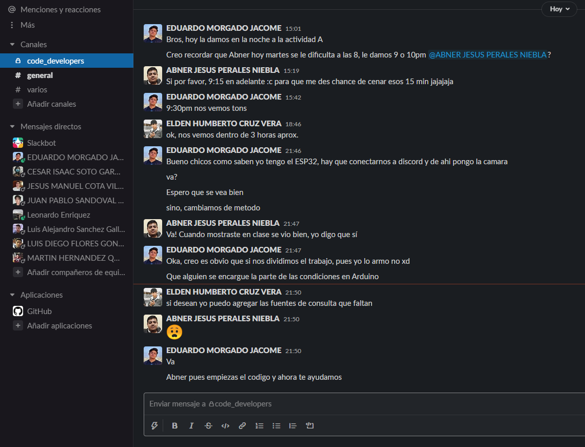
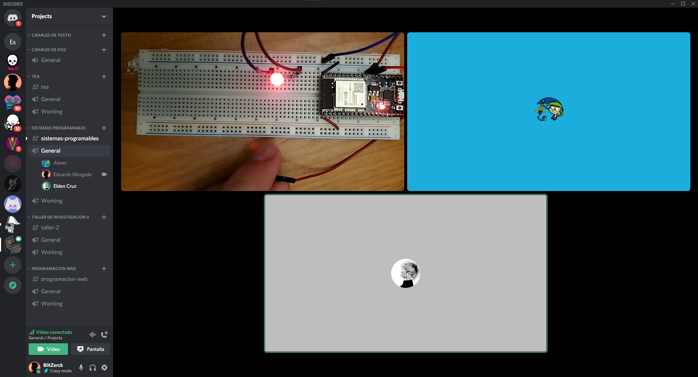
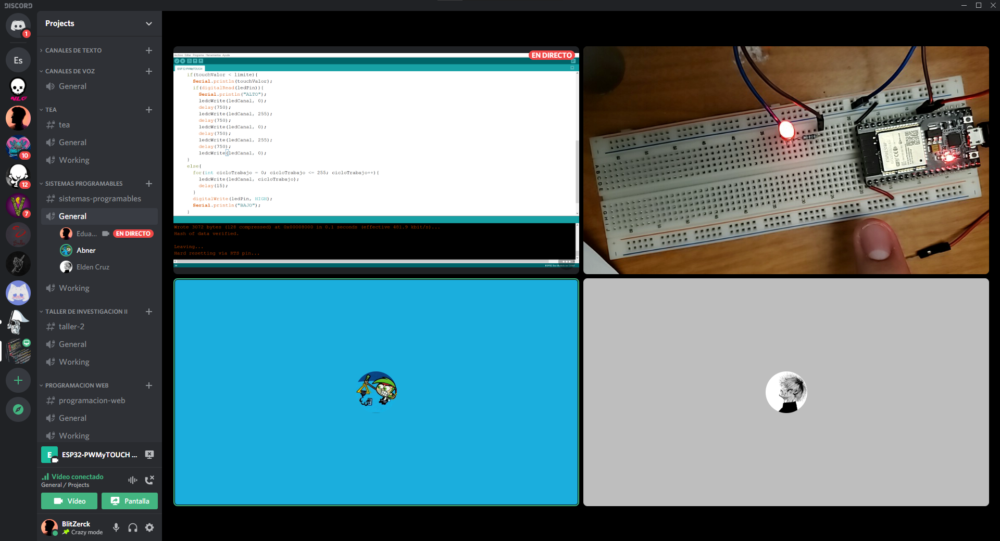

# :trophy: A.3.2 Actividad de aprendizaje

Circuito sensor de tacto a través de un NodeMCU ESP32
___

## Instrucciones

- Basado en la figura 1, ensamblar un sistema, capaz de responder al tacto, a través de un circuito electrónico, utilizando un NodeMCU **ESP32**, un  **Sensor de tacto capacitivo**.
- Toda actividad o reto se deberá realizar utilizando el estilo **MarkDown con extension .md** y el entorno de desarrollo VSCode, debiendo ser elaborado como un documento **single page**, es decir si el documento cuanta con imágenes, enlaces o cualquier documento externo debe ser accedido desde etiquetas y enlaces, y debe ser nombrado con la nomenclatura **A3.2_NombreApellido_Equipo.pdf.**
- Es requisito que el .md contenga una etiqueta del enlace al repositorio de su documento en GITHUB, por ejemplo **Enlace a mi GitHub** y al concluir el reto se deberá subir a github.
- Desde el archivo **.md** exporte un archivo **.pdf** que deberá subirse a classroom dentro de su apartado correspondiente, sirviendo como evidencia de su entrega, ya que siendo la plataforma **oficial** aquí se recibirá la calificación de su actividad.
- Considerando que el archivo .PDF, el cual fue obtenido desde archivo .MD, ambos deben ser idénticos.
- Su repositorio ademas de que debe contar con un archivo **readme**.md dentro de su directorio raíz, con la información como datos del estudiante, equipo de trabajo, materia, carrera, datos del asesor, e incluso logotipo o imágenes, debe tener un apartado de contenidos o indice, los cuales realmente son ligas o **enlaces a sus documentos .md**, _evite utilizar texto_ para indicar enlaces internos o externo.
- Se propone una estructura tal como esta indicada abajo, sin embargo puede utilizarse cualquier otra que le apoye para organizar su repositorio.
  
```
- readme.md
  - blog
    - C3.1_TituloActividad.md
    - C3.2_TituloActividad.md
    - C3.3_TituloActividad.md
    - C3.4_TituloActividad.md
    - C3.5_TituloActividad.md
    - C3.6_TituloActividad.md
    - C3.7_TituloActividad.md
    - C3.8_TituloActividad.md
  - img
  - docs
    - A3.1_TituloActividad.md
    - A3.2_TituloActividad.md
    - A3.3_TituloActividad.md
```
___

### Fuentes de apoyo para desarrollar la actividad

- [x] [Sensor de tacto capacitivo](https://randomnerdtutorials.com/esp32-touch-pins-arduino-ide/)
- [x] [Salida analogica PWM](https://randomnerdtutorials.com/esp32-pwm-arduino-ide/)

___

## Desarrollo

1.Utilice el siguiente listado de materiales para la elaboración de la actividad

| Cantidad | Descripción                                                                                                                                                                                                                |
| -------- | -------------------------------------------------------------------------------------------------------------------------------------------------------------------------------------------------------------------------- |
| 1        | [Diodo led Rojo](https://www.electronicaembajadores.com/datos/pdf1/sm/smdl/smdl5dv.pdf)                                                                                                                                                                                                             |
| 1        | [Resistencia 330 ohms](http://www.juntadeandalucia.es/averroes/centros-tic/29009909/helvia/aula/archivos/_56/RESISTENCIAS-TABLAS.pdf)                                                                                                                                                                                                       |
| 1        | Fuente de voltaje de 5V                                                                                                                                                                                                    |
| 1        | [NodeMCU ESP32](https://www.amazon.com.mx/ESP-32-ESP-32S-ESP-WROOM-32-ESP32-S-desarrollo/dp/B07TBFC75Z/ref=sr_1_2?__mk_es_MX=%C3%85M%C3%85%C5%BD%C3%95%C3%91&dchild=1&keywords=esp32&qid=1599003438&sr=8-2)                |
| 1        | [BreadBoard](https://www.amazon.com.mx/Deke-Home-Breadboard-distribuci%C3%B3n-electr%C3%B3nica/dp/B086C9HK7V/ref=sr_1_22?__mk_es_MX=%C3%85M%C3%85%C5%BD%C3%95%C3%91&dchild=1&keywords=breadboard&qid=1599003455&sr=8-22)   |
| 1        | [Jumpers M/M](https://www.amazon.com.mx/ELEGOO-Macho-Hembra-Macho-Macho-Hembra-Hembra-Protoboard/dp/B06ZXSQ5WG/ref=sr_1_1?__mk_es_MX=%C3%85M%C3%85%C5%BD%C3%95%C3%91&dchild=1&keywords=jumper+wires&qid=1599003519&sr=8-1) |
| 1        | Hoja de aluminio                                                                                                                                        
<p align="center"> 
    <strong>Figura 1 Circuito ESP32 IC L293 Motor DC</strong>
    
</p>

2. Una vez ensamblado el circuito anterior, realice un programa que permita al ensamble cumplir con las siguientes condiciones:
    - El sistema deberá ser capaz de encender y apagar **un led** al presionar el sensor de tacto.
    - El sistema deberá tener la característica que si el Led esta encendido, al tocar el sensor de tacto, este iniciara un secuencia de intermitencia de 3 segundos (es decir se apaga 1 segundo, se enciende un segundo y se apaga finalmente).
    - El sistema deberá contar con la característica que si el Led esta apagado, al tocar el sensor de tacto, este se encenderá poco a poco hasta llegar a su nivel máximo de iluminación.

#### :page_facing_up: Codigo
    //declaracion de variables
    const int touchPin = 4;
    const int ledPin = 16;
    //Se estable el numero maximo que retorna
    //el ESP32 cuando se toca el sensor, el cual
    //es el punto entre los valores de cuando
    //se toca el sensor y cuando no.
    const int limite = 20;
    int touchValor;
    const int freq = 5000;
    const int ledCanal = 0;
    const int resolucion = 8;

    void setup() {
      Serial.begin(9600);
      delay(1000);
      //Se establece el pin donde esta conectado el led como
      //pin de salida.
      pinMode(ledPin, OUTPUT);

      //se utiliza la siguiente funcion para inicializar la configuracion para
      //el PWM, tomando como parametros el canal, la frecuencia y la resolucion
      //respectivamente.
      ledcSetup(ledCanal,freq, resolucion);

      //Se relacina el pin GPIO con el canal del PWM.
      ledcAttachPin(ledPin, ledCanal);
    }

    void loop() {
      //Se guarda en una variable el valor que retorna
      //la funcion de touchRead que necesita como parametro
      //el pin que detecta el touch.
      touchValor = touchRead(touchPin);

        //Si este valor medido es menor al limite establecido
        //enciende el LED.
        if(touchValor < limite){
          //Si el estado del led es HIGH, entra a la primera
          //condicion.
          if(digitalRead(ledPin)){
            //Se enciende y se apague el LED en un tiempo de
            //3 segundos.
            ledcWrite(ledCanal, 0);
            delay(750);
            ledcWrite(ledCanal, 255);
            delay(750);
            ledcWrite(ledCanal, 0);
            delay(750);
            ledcWrite(ledCanal, 255);
            delay(750);
            ledcWrite(ledCanal, 0);
        }
        //Si el estado del led es LOW...
        else{
          //ciclo para subir la intensidad del LED de 0 a 255 porque se eligio
          //una resolucion de 8 bits = 256
          for(int cicloTrabajo = 0; cicloTrabajo <= 255; cicloTrabajo++){
            ledcWrite(ledCanal, cicloTrabajo);
            delay(15);
          }
        }
      }
    }
 

3. Coloque aquí evidencias que considere importantes durante el desarrollo de la actividad.





4. Incluya las conclusiones individuales y resultados observados durante el desarrollo de la actividad.

- *Morgado Jacome Eduardo*
  > La realizacion de la actividad no fue complicada ya que era una combinacion de las ultimas practicas que realizamos con el ESP32, lo cual llevo a posicionar todo nuestro esfuerzo en la logica del codigo para que hiciera lo que pide la actividad. <br> En este punto primero pensamos en como detectar cuando el LED esta encendio o apagado, donde mi compañero Elden fue de gran ayuda al investigar la documentacion de arduino y decirnos que la funcion "digitalRead" retornaba un booleano para saber si estaba encendido o no. Tambien fue de util ayuda investigar el funcionamiento de las funciones de la libreria de LED Control de Espressif ya que nos ayudo a saber como debiamos encender y apagar el Led con PWM. Una vez mas confirmo que el hacer una investigacion previa de los componentes electronicos y las funciones del entorno de desarrollo es de gran ayuda para evitar problemas durante la realizacion del ejercicio, y mas aun cuando estamos utilizando componentes fisicos con el peligro de estropearlos.

- *Perales Niebla Abner Jesus*
  >Esta práctica me resulto especialmente emocionante; a pesar de que, al igual que los demás equipos, solo un integrante tiene los componentes físicos, trabajamos juntos para realizar el proyecto. Esto se debe en gran manera a que mi compañero Morgado, quien tiene los componentes, nos comparte en vivo de la cámara con la que presenta el circuito y a la vez su pantalla, donde tiene el código. De esta forma podemos interactuar con el circuito y el código los otros dos. Sobre la práctica en sí, me tocó comenzar con el código, y me ayudó mucho el hecho de que Morgado nos haya explicado los circuitos anteriores, así como que tenga muy bien comentado su código. Eso me permitió combinar el código de los programas anteriores y, aunque tuvimos que hacer modificaciones al código, no provoqué ningún error de sintáxis, a pesar que yo trabajo las simulaciones con arduino. Luego los 3 como equipo, nos pusimos a razonar las instrucciones y cada quien aportó algo importante para la realicación del programa.

- *Cruz Vera Elden Humberto*
  > Durante la realización de la práctica se tuvo un pequeño inconveniente al realizar la intermitencia y apagado del led. Debido a que el programa si podía determinar cuando el led estuviera encendido con la función digitalRead, pero a la hora de utilizar digitalWrite para apagar el led no sucedía nada, esto se corrigió con la función ledcWrite.
  Y me pareció interesante que al cambiar el valor del canal del led de 0 a un valor distinto no había un cambio, lo único que podía producir una diferencia notable era cambiar el valor límite para detectar un objeto con el sensor del ESP32.

___

### :bomb: Rubrica

| Criterios     | Descripción                                                                                  | Puntaje |
| ------------- | -------------------------------------------------------------------------------------------- | ------- |
| Instrucciones | Se cumple con cada uno de los puntos indicados dentro del apartado Instrucciones?            | 10      |
| Desarrollo    | Se respondió a cada uno de los puntos solicitados dentro del desarrollo de la actividad?     | 60      |
| Demostración  | El alumno se presenta durante la explicación de la funcionalidad de la actividad?            | 20      |
| Conclusiones  | Se incluye una opinión personal de la actividad  por cada uno de los integrantes del equipo? | 10      |

:house: [Ir a inicio](../readme.md)

##### :open_file_folder: [Repositorio de Github de Morgado Jacome Eduardo](https://github.com/EduardoMJ99/SistemasProgramables_2020-2.git) :open_file_folder:
##### :open_file_folder: [Repositorio de Github de Cruz Vera Elden Humberto](https://github.com/CruzVeraEldenHumberto/Sistemas-Programables) :open_file_folder:
##### :open_file_folder: [Repositorio de Github de Perales Niebla Abner Jesús](https://github.com/AbnerPerales19/SistemasProgramables_AbnerPerales.git) :open_file_folder: