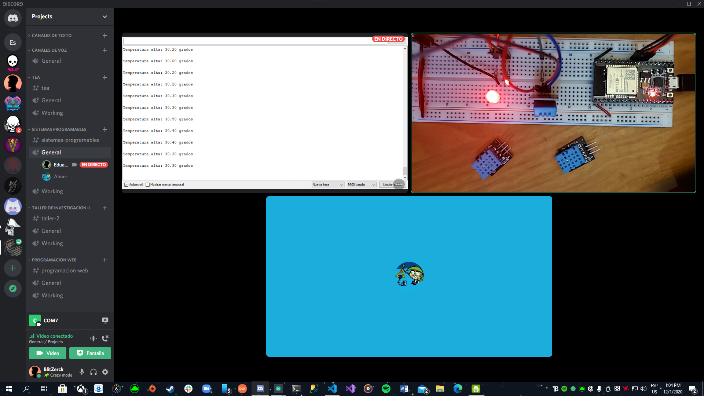

# :trophy: A.3.3 Actividad de aprendizaje

Circuito de medición de temperatura a través de un NodeMCU ESP32
___

## Instrucciones

- Basado en la figura 1, ensamblar un sistema, capaz de detectar la temperatura y humedad del ambiente, a través de un circuito electrónico, utilizando un NodeMCU **ESP32**, y un **Sensor DHT11/DHT22**.
- Toda actividad o reto se deberá realizar utilizando el estilo **MarkDown con extension .md** y el entorno de desarrollo VSCode, debiendo ser elaborado como un documento **single page**, es decir si el documento cuanta con imágenes, enlaces o cualquier documento externo debe ser accedido desde etiquetas y enlaces, y debe ser nombrado con la nomenclatura **A3.3_NombreApellido_Equipo.pdf.**
- Es requisito que el .md contenga una etiqueta del enlace al repositorio de su documento en GITHUB, por ejemplo **Enlace a mi GitHub** y al concluir el reto se deberá subir a github.
- Desde el archivo **.md** exporte un archivo **.pdf** que deberá subirse a classroom dentro de su apartado correspondiente, sirviendo como evidencia de su entrega, ya que siendo la plataforma **oficial** aquí se recibirá la calificación de su actividad.
- Considerando que el archivo .PDF, el cual fue obtenido desde archivo .MD, ambos deben ser idénticos.
- Su repositorio ademas de que debe contar con un archivo **readme**.md dentro de su directorio raíz, con la información como datos del estudiante, equipo de trabajo, materia, carrera, datos del asesor, e incluso logotipo o imágenes, debe tener un apartado de contenidos o indice, los cuales realmente son ligas o **enlaces a sus documentos .md**, _evite utilizar texto_ para indicar enlaces internos o externo.
- Se propone una estructura tal como esta indicada abajo, sin embargo puede utilizarse cualquier otra que le apoye para organizar su repositorio.
  
```
- readme.md
  - blog
    - C3.1_TituloActividad.md
    - C3.2_TituloActividad.md
    - C3.3_TituloActividad.md
    - C3.4_TituloActividad.md
    - C3.5_TituloActividad.md
    - C3.6_TituloActividad.md
    - C3.7_TituloActividad.md
    - C3.8_TituloActividad.md
  - img
  - docs
    - A3.1_TituloActividad.md
    - A3.2_TituloActividad.md
    - A3.3_TituloActividad.md
```

### Fuentes de apoyo para desarrollar la actividad:

   - [x] [Random Nerd Tutorial Touch pin](https://randomnerdtutorials.com/esp32-touch-pins-arduino-ide/)

   - [x] [Ejemplo de circuito con LED RGB Led](https://i0.wp.com/saber.patagoniatec.com/wp-content/uploads/2019/07/led-rgb-catodo-anado-comun.jpg)

___

## Desarrollo

1.Utilice el siguiente listado de materiales para la elaboración de la actividad

| Cantidad | Descripción                                                                                                                                                                                                                           |
| -------- | ------------------------------------------------------------------------------------------------------------------------------------------------------------------------------------------------------------------------------------- |
| 1        | [Sensor temperatura y humedad DHT11](https://articulo.mercadolibre.com.mx/MLM-664315278-sensor-de-temperatura-y-humedad-dht11-cjumpers-arduino-pic-_JM#position=1&type=item&tracking_id=b203e8cd-c375-429a-9b75-8c57e8b35386) o DHT22 |
| 1        |  [Diodo led RGB](http://descargas.cetronic.es/LEDRGB.pdf)                                                                                                                                                                                                                         |
| 1        | [Resistencia 4.7 kohms](http://www.juntadeandalucia.es/averroes/centros-tic/29009909/helvia/aula/archivos/_56/RESISTENCIAS-TABLAS.pdf)                                                                                                                                                                                                                 |
| 3        | [Resistencias 1 kohm](https://agelectronica.lat/pdfs/textos/R/RC.30E12.PDF)                                                                                                                                                                                                                   |
| 1        | Fuente de voltaje de 5V                                                                                                                                                                                                               |
| 1        | [NodeMCU ESP32](https://articulo.mercadolibre.com.mx/MLM-587686290-esp32-wifi-bluetooth-42-ble-nodemcu-esp8266-libro-gratis-_JM#position=1&type=item&tracking_id=84a6234b-5016-47eb-9950-39b49846ca72)                                |
| 1        | [BreadBoard](https://www.amazon.com.mx/Deke-Home-Breadboard-distribuci%C3%B3n-electr%C3%B3nica/dp/B086C9HK7V/ref=sr_1_22?__mk_es_MX=%C3%85M%C3%85%C5%BD%C3%95%C3%91&dchild=1&keywords=breadboard&qid=1599003455&sr=8-22)                                                                                                                                                                                                                            |
| 1        | [Jumpers M/M](https://www.amazon.com.mx/ELEGOO-Macho-Hembra-Macho-Macho-Hembra-Hembra-Protoboard/dp/B06ZXSQ5WG/ref=sr_1_1?__mk_es_MX=%C3%85M%C3%85%C5%BD%C3%95%C3%91&dchild=1&keywords=jumper+wires&qid=1599003519&sr=8-1)                                                                                                                                                                                                                           |
       

2. Basado en las imágenes que se muestran en la **Figuras 1**, ensamble el circuito en un solo circuito electrónico, ide tal manera que se pueda obtener un sistema capaz de cumplir con las instrucciones antes solicitadas para esta actividad.
  
<p align="center"> 
    <strong>Figura 1 Circuito ESP32 y Sensor DHT</strong>
    
</p>

1.  Una vez ensamblado el circuito anterior, agregue un LED RGB y elabore el programa que le permita al LED RGB funcionar como indicador para las siguientes condiciones:
    - El sensor de temperatura en todo momento estará sensando, enviando el valor registrado por la terminal serial, por ejemplo "Temperatura ambiente: 25 grados" y el **LED RGB** estará encendido de color verde.
    - El sensor de temperatura al registrar un valor del ~20% por arriba de la temperatura ambiental, deberá mostrar el mensaje "Temperatura alta: ? grados" y el **LED RGB** se encenderá de color rojo.
    - El sensor de temperatura al registra un valor del ~20% por abajo de la temperatura ambiental, deberá mostrar el mensaje "Temperatura baja: ? grados" y el **LED RGB** se encenderá de color azul.
2. Coloque aquí evidencias que considere importantes durante el desarrollo de la actividad.
   
  
  
  
  
  

3. Código:
    ```
    #include "DHT.h" //incluye la libreria para el senshor DHT

    //definimos el pin del ESP32 que utilizaremos para el sensor
    #define DHTPIN 4 

    #define DHTTYPE DHT11   //define el tipo de sensor, DHT 11

    //Creamos un objeto llamado dht, de tipo DHT, asignando
    //el tipo de sensor y el pin
    DHT dht(DHTPIN, DHTTYPE);

    //Definimos los pines y canales para los PWM
    const int ledRojo = 16;
    const int ledCanalRojo = 0;
    const int ledVerde= 17;
    const int ledCanalVerde= 1;
    const int ledAzul= 5;
    const int ledCanalAzul = 2;

    //Definimos la frecuencia y resolucion para los PWM
    const int freq = 5000;
    const int resolucion = 8;


    void setup() {
      Serial.begin(9600); //inicia comunicación serial 
      //imprime mensaje de prueba

      pinMode(ledRojo, OUTPUT);
      pinMode(ledVerde, OUTPUT);
      pinMode(ledAzul, OUTPUT);

      ledcSetup(ledCanalRojo, freq, resolucion);
      ledcSetup(ledCanalVerde, freq, resolucion);
      ledcSetup(ledCanalAzul, freq, resolucion);

      ledcAttachPin(ledRojo, ledCanalRojo);
      ledcAttachPin(ledVerde, ledCanalVerde);
      ledcAttachPin(ledAzul, ledCanalAzul);

      Serial.println("Mensaje de prueba de funcionalidad..."); 
      //Iniciamos el objeto dht
      dht.begin();
    }

    void loop() {
      //Esperamos 2 segundos para continuar, puesto que lo más que
      //puede tardar el sensor en leer los valores son 2 segundos
      delay(2000);

      //Guarda el valor de la lectura de humedad en una variable float 
      float h = dht.readHumidity();
      //Guarda el valor de la lectura de temperatura en una variable float, la cual es por defecto, en Celsius
      float t = dht.readTemperature();

      //Condición para saber si hubo algún fallo en la lectura
      if (isnan(h) || isnan(t)) {
        Serial.println("Error de lectura...");
        return;
      }
      
      if(t > 16 && t < 24){
        Serial.print("Temperatura ambiente: ");
        Serial.print(t);
        Serial.println(" grados");
        ledcWrite(ledCanalRojo,  0);
        ledcWrite(ledCanalVerde, 255);
        ledcWrite(ledCanalAzul,  0);
      } else if( t >= 24){
        Serial.print("Temperatura alta: ");
        Serial.print(t);
        Serial.println(" grados");
        ledcWrite(ledCanalRojo,  255);
        ledcWrite(ledCanalVerde, 0);
        ledcWrite(ledCanalAzul,  0);
      } else {
        Serial.print("Temperatura baja: ");
        Serial.print(t);
        Serial.println(" grados");
        ledcWrite(ledCanalRojo,  0);
        ledcWrite(ledCanalVerde, 0);
        ledcWrite(ledCanalAzul,  255);
      }
      Serial.println();
    }
    ```

4. Incluya las conclusiones individuales y resultados observados durante el desarrollo de la actividad.

- *Morgado Jacome Eduardo*
  > Esta fue la primera actividad que realizamos utilizando algun sensor fuera del ESP32, y realmente fue sencilla tanto su programacion y ensamble. Gracias a las librerias que se ofrencen para el IDE de Arduino pudimos resolver el problema planteado en la actividad facilmente. Fue importante determinar el orden de los pines de nuestro sensor DHT11 ya que existen diferencias segun el fabricante, y nuestro obstaculo fue que nuestro LED RGB era de dos pines, con el cual no se puede determinar el color que queremos manualmente, por lo tanto adquirimos uno de 4 pines, y una vez conectado correctamente pudimos resolver la actividad en su totalidad. Observe de igual manera la gran capacidad del sensor, ya que los rangos de temperatura que maneja me parecen suficientes para poder implementar en muchos lugares, y hacer que pasen cosas en funcion de estos cambios con ayuda de un microcontrolador.

- *Perales Niebla Abner Jesus*
  > Me gustó mucho cómo elaboramos esta práctica en equipo, mi compañero Morgado elaboró el circuito mientras Elden y yo hacíamos el código. Con respecto al circuito físico, me pareció bastante gracioso el hecho de que Morgado tuviera 3 sensores DHT11, uno que utilizaba como temperatura ambiente, uno que metía en el congelador un par de minutos y salía con temperatura de -4°C, y el tercero que colocaba a un calentón y terminaba con una temperatura de 40°C. En cuanto al código, mi compañero Elden y yo lo hicimos juntos, basándonos en una práctia en random nerd tutorials y las prácticas pasadas donde utilizábamos PWM. Me hizo sentir muy conforme el hecho de que Elden y yo nos entendierámos a la hora de codificar y no discutimos por cómo debe ir el código, definitivamente fue un trabajo en equipo el cómo elaboramos esta práctica los 3.

- *Cruz Vera Elden Humberto*
  > Se tuvo una pequeña dificultad a la hora de realizar la actividad, debido a que teníamos un le rgb de 2 pines, el cual funciona de una manera muy distinta al de 4 y esto ocasionó un retardo en la terminación de esta. <br> Algo que me pareció muy interesante fue que existen dos tipos de led rgb, uno con cátodo común y uno con ánodo común, antes de realizar la actividad tuvimos que comprobar nuestro tipo de led para que funcionara de la manera adecuada. <br> Me sorprendió bastante las temperaturas a las que puede trabajar el DHT11, ya que uno pensaría que este dejaría de servir al estar expuesto a temperaturas demasiado altas o bajas.

___

### :bomb: Rubrica

| Criterios     | Descripción                                                                                  | Puntaje |
| ------------- | -------------------------------------------------------------------------------------------- | ------- |
| Instrucciones | Se cumple con cada uno de los puntos indicados dentro del apartado Instrucciones?            | 10      |
| Desarrollo    | Se respondió a cada uno de los puntos solicitados dentro del desarrollo de la actividad?     | 60      |
| Demostración  | El alumno se presenta durante la explicación de la funcionalidad de la actividad?            | 20      |
| Conclusiones  | Se incluye una opinión personal de la actividad  por cada uno de los integrantes del equipo? | 10      |

:house: [Ir a inicio](../readme.md)

##### :open_file_folder: [Repositorio de Github de Morgado Jacome Eduardo](https://github.com/EduardoMJ99/SistemasProgramables_2020-2.git) :open_file_folder:
##### :open_file_folder: [Repositorio de Github de Cruz Vera Elden Humberto](https://github.com/CruzVeraEldenHumberto/Sistemas-Programables) :open_file_folder:
##### :open_file_folder: [Repositorio de Github de Perales Niebla Abner Jesús](https://github.com/AbnerPerales19/SistemasProgramables_AbnerPerales.git) :open_file_folder: