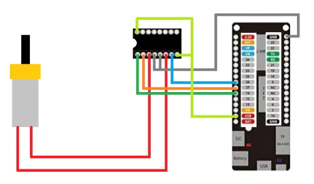

# :trophy: A4.1 Actividad de aprendizaje

Circuito de control para activar y desactivar un motor DC, utilizando  NodeMCU ESP32 por medio de Bluetooth
___

## Instrucciones

- Realizar un sistema ensamblado de control por medio de **Bluetooth**, capaz de control a un motor DC, utilizando un NodeMCU **ESP32**, un y un **IC L293D**.
- Toda actividad o reto se deberá realizar utilizando el estilo **MarkDown con extension .md** y el entorno de desarrollo VSCode, debiendo ser elaborado como un documento **single page**, es decir si el documento cuanta con imágenes, enlaces o cualquier documento externo debe ser accedido desde etiquetas y enlaces, y debe ser nombrado con la nomenclatura **A4.1_NombreApellido_Equipo.pdf.**
- Es requisito que el .md contenga una etiqueta del enlace al repositorio de su documento en GITHUB, por ejemplo **Enlace a mi GitHub** y al concluir el reto se deberá subir a github.
- Desde el archivo **.md** exporte un archivo **.pdf** que deberá subirse a classroom dentro de su apartado correspondiente, sirviendo como evidencia de su entrega, ya que siendo la plataforma **oficial** aquí se recibirá la calificación de su actividad.
- Considerando que el archivo .PDF, el cual fue obtenido desde archivo .MD, ambos deben ser idénticos.
- Su repositorio ademas de que debe contar con un archivo **readme**.md dentro de su directorio raíz, con la información como datos del estudiante, equipo de trabajo, materia, carrera, datos del asesor, e incluso logotipo o imágenes, debe tener un apartado de contenidos o indice, los cuales realmente son ligas o **enlaces a sus documentos .md**, _evite utilizar texto_ para indicar enlaces internos o externo.
- Se propone una estructura tal como esta indicada abajo, sin embargo puede utilizarse cualquier otra que le apoye para organizar su repositorio.
  
```
- readme.md
  - blog
    - C4.1_TituloActividad.md
    - C4.2_TituloActividad.md
    - C4.3_TituloActividad.md
    - C4.4_TituloActividad.md    
  - img
  - docs
    - A4.1_TituloActividad.md
    - A4.2_TituloActividad.md
    - A4.3_TituloActividad.md
```
___

### Fuentes de apoyo para desarrollar la actividad

- [x] [Random Nerd Tutorial DHT Humedad y temperatura](https://randomnerdtutorials.com/esp32-dht11-dht22-temperature-humidity-sensor-arduino-ide/)
- [x] [Motor DC con IC L293 y ESP32](https://www.hackster.io/Oniichan_is_ded/l293d-with-esp32-wemos-lolin-d32-v2-hacked-edition-ea2086)

___

## Desarrollo

1.Utilizar el siguiente listado de materiales para la elaboración de la actividad

| Cantidad | Descripción                                                                                                                                                                                                                |
| -------- | -------------------------------------------------------------------------------------------------------------------------------------------------------------------------------------------------------------------------- |
| 1        | [IC L293D](https://www.mouser.mx/ProductDetail/STMicroelectronics/L293D?qs=gr8Zi5OG3MgMJ1ICDzL[…]term=L293D&utm_content=STMicroelectronics&source=Datasheets360)             |
| 1        | Fuente de voltaje de 5V                                                                                                                                                                                                    |
| 1        | [NodeMCU ESP32](https://www.amazon.com.mx/ESP-32-ESP-32S-ESP-WROOM-32-ESP32-S-desarrollo/dp/B07TBFC75Z/ref=sr_1_2?__mk_es_MX=%C3%85M%C3%85%C5%BD%C3%95%C3%91&dchild=1&keywords=esp32&qid=1599003438&sr=8-2)                |
| 1        | [BreadBoard](https://www.amazon.com.mx/Deke-Home-Breadboard-distribuci%C3%B3n-electr%C3%B3nica/dp/B086C9HK7V/ref=sr_1_22?__mk_es_MX=%C3%85M%C3%85%C5%BD%C3%95%C3%91&dchild=1&keywords=breadboard&qid=1599003455&sr=8-22)   |
| 1        | [Jumpers M/M](https://www.amazon.com.mx/ELEGOO-Macho-Hembra-Macho-Macho-Hembra-Hembra-Protoboard/dp/B06ZXSQ5WG/ref=sr_1_1?__mk_es_MX=%C3%85M%C3%85%C5%BD%C3%95%C3%91&dchild=1&keywords=jumper+wires&qid=1599003519&sr=8-1) |
| 1| [Motor Reductor](http://www.master.com.mx/img/fichas/AR-DCMOTOR.pdf) |

2. Basado en las imágenes que se muestran en las **Figura 1**, ensamblar un circuito electrónico, con la finalidad de obtener un sistema capaz de cumplir con las instrucciones siguientes:
   
  + Por medio de la aplicación "Serial Bluetooth terminal" que puede ser descargada del play Store de google o incluso cualquier otra que considere, se deberá controlar el arranque y apagado de un motor DC, es decir se contara con dos peticiones, la cual una de ellas representara el **"START" y la otra opción "STOP"**
  + El motor debe ser capaz de girar a favor de las manecillas del reloj durante 5 segundos, al cumplirse ese tiempo debe frenar 1 segundo e invertirá su giro durante otros 5 segundos, es decir la actividad debe tener la secuencia siguiente: El **stop** puede ser ejecutado en cualquier instante, y el motor estará ejecutando 5s en forward, 1s stop, 5s reverse, 1s stop, 5s forward, 1s stop, 5s reverse,...
    
<p align="center"> 
    <strong>Figura 1 Circuito ESP32 IC L293 Motor DC</strong>
    
</p>

3. Coloque aquí la imagen del circuito ensamblado

  
  
  
  

4. Coloque en este lugar el programa creado dentro del entorno de Arduino

    ```C
    //Se incluye la libreria Bluetooth
    #include "BluetoothSerial.h"

    //Se comprueba si el BT esta activado.
    #if !defined(CONFIG_BT_ENABLED) || !defined(CONFIG_BLUEDROID_ENABLED)
    #error Bluetooth is not enabled! Please run `make menuconfig` to and enable it
    #endif

    //Se crea una instancia de la libreria de BT
    BluetoothSerial SerialBT;

    //Variables para el movimiento del motor
    int contador = 0;
    bool banderaGiro= false;
    char caracter;
    bool banderaStop = false;
    int PinMotor1 = 16;
    int PinMotor2 = 17;
    int PinEnable = 4;

    void setup() {
      Serial.begin(115200);
      pinMode(PinMotor1, OUTPUT);
      pinMode(PinMotor2, OUTPUT);
      pinMode(PinEnable, OUTPUT);
      digitalWrite(PinEnable, HIGH);

      //Que nombre se le asigna al ESP32 con BT.
      SerialBT.begin("ESP32CodeDeve"); //Bluetooth device name
      Serial.println("The device started, now you can pair it with bluetooth!");
    }

    void loop() {
      //Si hay algo escrito en el puerto serial del BT...
      if (SerialBT.available()) {  
        //Obtengo lo que se lee en una variable
        caracter = SerialBT.read();
      }
      
      if(String(caracter) == "1"){ //si el caracter introducido es 1 enciende el motor
          banderaStop = true; // Esta bandera indica que lo último introducido fue un 1
        }
      //Si es 0 se detiene el motor
      if(String(caracter) == "0"){
        contador = 0;
        banderaGiro = false;
        banderaStop = false;
        digitalWrite(PinMotor1, LOW); //deja en low el primer pin del motor
        digitalWrite(PinMotor2, LOW); //deja en low el segundo pin del motor
      }
      
      // Cuando el motor está en funcionamiento y aún no cumple 5 segundos de giro
      if(banderaStop && contador <= 5){
          // Cuando el motor se está moviendo, debemos indicar a donde
          if(contador != 5){  
            // Cuando la banderaGiro es false, entonces gira en sentido de las manecillas del reloj
            // y cuando es true, gira en sentido contrario
            if(banderaGiro== false){
              digitalWrite(PinMotor1, HIGH); //deja el primer pin en high
              digitalWrite(PinMotor2, LOW); //deja el segundo pin en low
            }
            if(banderaGiro== true){
              //se invierten los estados de los pines en comparación a la instrucción anterior
              digitalWrite(PinMotor1, LOW);
              digitalWrite(PinMotor2, HIGH);
            }
            contador++; //incrementa el contador en 1
          }
          else { // Cuando ya giró por 5 segundos (contador = 5), se frena y cambia la dirección.
            // Detenemos el motor
            digitalWrite(PinMotor1, LOW);
            digitalWrite(PinMotor2, LOW);
            // Cambiamos la dirección de giro
            banderaGiro= !banderaGiro;
            contador = 0;     // Establecemos la cantidad de giros en 0
          }   
          delay(1000); //el motor se queda detenido un segundo
      }  
    }
    ```
5. Coloque aquí evidencias que considere importantes durante el desarrollo de la actividad.

  
  
  
  
  

6. Incluya las conclusiones individuales y resultados observados durante el desarrollo de la actividad.

- *Morgado Jacome Eduardo*
  > Para el desarrollo de la actividad, la parte de la conexion bluetooth y el leer datos enviados del telefono al ESP32 fue sencilla, gracias a las librerias y documentacion existente, no cabe duda que el ESP32 esta por encima de la capacidad de un Arduino UNO. La mayor dificultad para realizar la actividad fue el como detectar el detener el motor en cualquier momento aunque este realizando otra accion el ESP32. <br> Para lograr esto, gracias al profesor nos dimos cuenta que existen "interrupciones" y que son muy utiles, que hay por hardware y por software, lamentablemente se nos dificulto entender como funcionan estos bloques de codigo, por lo que optamos manejarlo que por cada iteracion del ``` void loop ``` (que seria cada segundo) se leyera en el BT si se deseaba detener el motor, si si, se detenia, si no el ciclo continuaba normalemnte. Esto ultimo nos funciono y pudimos resolver el desarrollo de la actividad, sin embargo, al menos de mi parte, aprendi la existencia y el uso de las interrupciones en microcontroladores y planeo aprender a utilizarlos.

- *Perales Niebla Abner Jesus*
  > Lo que particularmente me gusto de esta práctica fue el tiempo que tardamos en realizarla y la forma en que resolvimos el algoritmo. En cuanto al tiempo, varios equipos dijeron que tardaron 3 horas y aún así no podían resolverlo, lo que nos pareció extraño, puesto que nosotros realizamos la práctica completa en aproximadamente 2 horas. Claro que la práctica tuvo su complejidad, sin embargo, fue el trabajo en equipo quien aminoró esa complejidad, por ejemplo, en un inicio yo hice el código, puesto que no soy bueno explicando las ideas, me vi en la necesidad de plasmarlo. Como es de imaginarse, no funcionó correctamente al ejecutarlo, pero al menos compiló, luego mi compañero Morgado fue cambiando el orden de algunas condiciones y modificándolas, ahí fue cuando ya funcionaba casi por completo. Luego, entre los 3 fuimos leyendo el código y nos dimos cuenta de pequeños detalles, como el pin enable que arregló mi compañero Elden, y algunas condiciones que aún no se cumplian.  Así logramos entre todos resolver la práctica y de una forma totalmente diferente a todos los demás equipos. Quizá el código fue un poco más complicado de entender, pero no requiere otro recurso más que condiciones y lógica para funcionar.

- *Cruz Vera Elden Humberto*
  > Se tuvo un par de inconvenientes en la realización de la práctica, principalmente al detener el motor, debido a que el motor se detenía antes de terminar el ciclo completo y aparte que al volver al apagar y encender el motor este siempre hacia el giro en contra las manecillas del reloj. Se solucionaron esos detalles modificando la condición para detener el motor y se invirtió el valor de una bandera para que cada vez que se encendiera el motor este siempre hiciera el giro acorde a las manecillas del reloj. Otro detalle fue que por lo menos yo desconocía que se tenía que dejar el pin enable de motor en high para que este encendiera.

___

### :bomb: Rubrica

| Criterios     | Descripción                                                                                  | Puntaje |
| ------------- | -------------------------------------------------------------------------------------------- | ------- |
| Instrucciones | Se cumple con cada uno de los puntos indicados dentro del apartado Instrucciones?            | 10      |
| Desarrollo    | Se respondió a cada uno de los puntos solicitados dentro del desarrollo de la actividad?     | 60      |
| Demostración  | El alumno se presenta durante la explicación de la funcionalidad de la actividad?            | 20      |
| Conclusiones  | Se incluye una opinión personal de la actividad  por cada uno de los integrantes del equipo? | 10      |


##### :open_file_folder: [Repositorio de Github de Morgado Jacome Eduardo](https://github.com/EduardoMJ99/SistemasProgramables_2020-2.git) :open_file_folder:
##### :open_file_folder: [Repositorio de Github de Cruz Vera Elden Humberto](https://github.com/CruzVeraEldenHumberto/Sistemas-Programables) :open_file_folder:
##### :open_file_folder: [Repositorio de Github de Perales Niebla Abner Jesús](https://github.com/AbnerPerales19/SistemasProgramables_AbnerPerales.git) :open_file_folder: