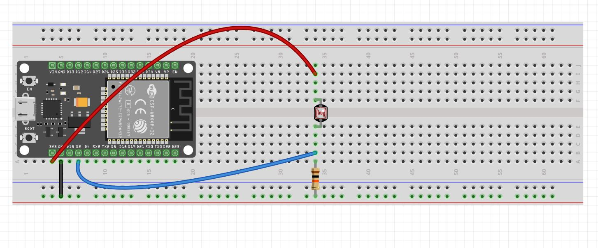
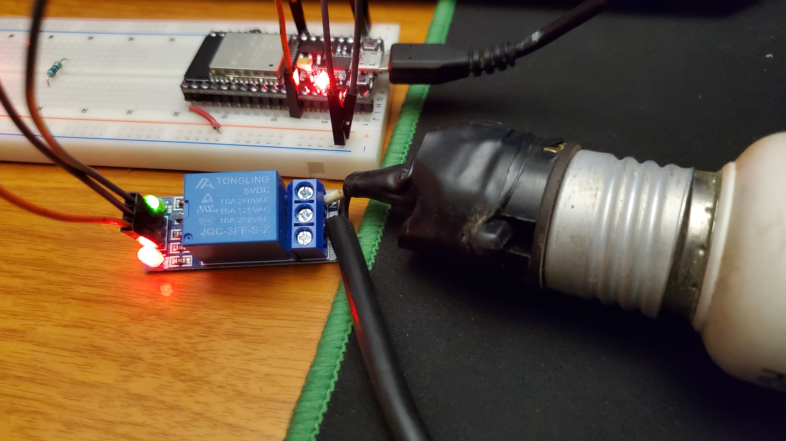

# :trophy: A4.2 Actividad de aprendizaje

Circuito sensor de iluminación y actuación de luz NodeMCU ESP32 por medio de Wi-Fi
___

## Instrucciones

- Realizar un sistema de medición y actuación de luz ambiental, utilizando el protocolo de comunicación **Wi-FI**, asi como un NodeMCU **ESP32**, un sensor  **LDR**, un diodo LED.
- Toda actividad o reto se deberá realizar utilizando el estilo **MarkDown con extension .md** y el entorno de desarrollo VSCode, debiendo ser elaborado como un documento **single page**, es decir si el documento cuanta con imágenes, enlaces o cualquier documento externo debe ser accedido desde etiquetas y enlaces, y debe ser nombrado con la nomenclatura **A4.2_NombreApellido_Equipo.pdf.**
- Es requisito que el .md contenga una etiqueta del enlace al repositorio de su documento en GITHUB, por ejemplo **Enlace a mi GitHub** y al concluir el reto se deberá subir a github.
- Desde el archivo **.md** exporte un archivo **.pdf** que deberá subirse a classroom dentro de su apartado correspondiente, sirviendo como evidencia de su entrega, ya que siendo la plataforma **oficial** aquí se recibirá la calificación de su actividad.
- Considerando que el archivo .PDF, el cual fue obtenido desde archivo .MD, ambos deben ser idénticos.
- Su repositorio ademas de que debe contar con un archivo **readme**.md dentro de su directorio raíz, con la información como datos del estudiante, equipo de trabajo, materia, carrera, datos del asesor, e incluso logotipo o imágenes, debe tener un apartado de contenidos o indice, los cuales realmente son ligas o **enlaces a sus documentos .md**, _evite utilizar texto_ para indicar enlaces internos o externo.
- Se propone una estructura tal como esta indicada abajo, sin embargo puede utilizarse cualquier otra que le apoye para organizar su repositorio.
  
```
- readme.md
  - blog
    - C4.1_TituloActividad.md
    - C4.2_TituloActividad.md
    - C4.3_TituloActividad.md
    - C4.4_TituloActividad.md    
  - img
  - docs
    - A4.1_TituloActividad.md
    - A4.2_TituloActividad.md
    - A4.3_TituloActividad.md
```
___

### Fuentes de apoyo para desarrollar la actividad

   - [x] [ESP32 Web Server](https://randomnerdtutorials.com/esp32-web-server-arduino-ide/)
   - [x] [LDR con ESP32](https://www.youtube.com/watch?v=A3qcN2mzv0Q)
   
___

## Desarrollo

1.Utilizar el siguiente listado de materiales para la elaboración de la actividad

| Cantidad | Descripción    |
| -------- | -------------- |
| 1        | [Modulo Sensor LDR]([https://articulo.mercadolibre.com.mx/MLM-623282168-modulo-sensor-de-luz-ldr-_JM)             |
| 1 | [Rele de 3.3v](http://magicduino.com/Images/ItemsMedia/File/7214.pdf ) |
| 1 | [Bombilla](https://euroelectrica.com.mx/descargas/FICHA-TECNICA-TL22075SLD8.pdf)  |
| 1        | Fuente de voltaje de 5V                                                                                                                                |
| 1        | [NodeMCU ESP32](https://www.amazon.com.mx/ESP-32-ESP-32S-ESP-WROOM-32-ESP32-S-desarrollo/dp/B07TBFC75Z/ref=sr_1_2?__mk_es_MX=%C3%85M%C3%85%C5%BD%C3%95%C3%91&dchild=1&keywords=esp32&qid=1599003438&sr=8-2)                |
| 1        | [BreadBoard](https://www.amazon.com.mx/Deke-Home-Breadboard-distribuci%C3%B3n-electr%C3%B3nica/dp/B086C9HK7V/ref=sr_1_22?__mk_es_MX=%C3%85M%C3%85%C5%BD%C3%95%C3%91&dchild=1&keywords=breadboard&qid=1599003455&sr=8-22)   |
| 1        | [Jumpers M/M](https://www.amazon.com.mx/ELEGOO-Macho-Hembra-Macho-Macho-Hembra-Hembra-Protoboard/dp/B06ZXSQ5WG/ref=sr_1_1?__mk_es_MX=%C3%85M%C3%85%C5%BD%C3%95%C3%91&dchild=1&keywords=jumper+wires&qid=1599003519&sr=8-1) |

2. Basado en la imágen que se muestran en las **Figura 1**, ensamble un circuito electrónico y agregue un Led y un rele a una de las terminales del dispositivo, de tal manera que se pueda obtener un sistema capaz de cumplir con las instrucciones siguiente:
    - Se deberá utilizar el NodeMCU como un **standalone Web server**, el cual deberá proveer una interface visual, que mostrara una imagen representando un comportamiento de "ON y OFF" dependiendo de la condición de iluminación ambiental.
    - El sensor de iluminación deberá estar midiendo la cantidad de luz que existen en el ambiente.
    - Al momento de detectar el sensor LDR, ausencia de luz deberá mostrar en la interface Web un estado "ON", y en caso contrario deberá representarse el estado "OFF".
    - Al circuito de la figura 1 se le deberá agregar un relevador en serie con una bombilla, que sera activada en condición opuesta al estado "ON" y "OFF", es decir una vez que el sensor detecto poca o nula iluminación activara el rele y por consecuencia encenderá la bombilla, y en caso contrario lo apagara.

[Fuente de apoyo Random Nerd Tutorial](https://randomnerdtutorials.com/esp32-web-server-arduino-ide/)
    
<p align="center"> 
    <strong>Figura 1 Circuito ESP32 Sensor LDR iluminacion</strong>
    
</p>

3. Coloque aquí la imagen del circuito ensamblado





4. Coloque en este lugar el programa creado dentro del entorno de Arduino.

    ```C
    /*
    WiFi Web Server Simple
    */
    //librerias para la comunicación wifi
    #include <WiFi.h> 
    #include <WebServer.h>
    const char* ssid = "INFINITUM2732_2.4"; //ssid de la red a la que se conectará el esp32
    const char* password =  "76cf6uNbpu"; //contraseña de la red a la que se conectará el esp32 
    int LEDpin = 14; //pin utilizado para el rele/bombilla
    bool FotoStatus = LOW; //variable para el estado del LDR
    int pinLuz = 17; //pin utilizado por el LDR
    int fotoresis = 0;
    WebServer server(80);  // Objeto de la clase WebServerObject(HTTP port, 80 es el default)
    void setup() {
      Serial.begin(115200); //inicia comunicación serial a 115200 bits por segundo
      Serial.println("Try Connecting to ");
      Serial.println(ssid);
      pinMode(LEDpin, OUTPUT); //define LEDpin como salida
      pinMode(pinLuz, INPUT); //define pinLuz como entrada
      // Inicia conección wifi
      WiFi.begin(ssid, password);
      // Checa si esta conectado a la red wifi
      while (WiFi.status() != WL_CONNECTED) {
      delay(1000);
      Serial.print(".");
      }
      Serial.println("");
      Serial.println("WiFi connected successfully");
      Serial.print("Got IP: ");
      Serial.println(WiFi.localIP());  //Show ESP32 IP on serial
      server.on("/", handle_root);
      server.begin();
      Serial.println("HTTP server started");
      delay(100); 
    }
    void loop() {
      server.handleClient();
      handle_root();
    }
    // metodo que contiene codigo HTML/CSS junto con la logica para cambiar el contenido de la pagina
    String HTML(bool FotoStatus) { 
      String texto = "<!DOCTYPE html>\
      <html>\
      <style> \
      .center {text-align:center;} \
      .button {display: block;background-color: #48d056;border: none;color: white;padding: 13px 30px;text-decoration: none;font-size: 100px;margin: 1% auto 1%;cursor: pointer;border-radius: 4px;}\
      .button-on {background-color: #c23636;}\
      .button-on:active {background-color: #c77676;}\
      .button-off {background-color: #0e977c;}\
      .button-off:active {background-color: #629e92;}\
      body{margin-top: 5%; }\
      a {width: 25%; box-shadow: 10px 5px 5px black; margin: 10% auto;}\
      h1 {color: #ffffff; } \
      h2 {color: #ffffff; }\
      div {box-shadow: 10px 5px 5px black;  margin: 10px auto 20px; max-width: 100%;  width: 80%; background-color: #5f70cf;  padding: 13px 30px; border-radius: 20px;}\
      </style>\
      <body class=\"center\">\
      <div>\
      <h1> Gestion del LED del penthouse de CodeDevelopers </h1>";
      if(FotoStatus){ //si FotoStatus es verdadero despliega en la pagina web que el led esta encendido
        texto += "<h2> Estado del LED: Encendido </h2>";
        texto += "";
      }
      else{ //si es falso despliega en la pagina web que el led esta apagado
        texto += "<h2> Estado del LED: Apagado </h2>";
        texto += "";
      }
      texto += "<meta http-equiv=\"refresh\" content=\"3\">";
      texto += "</div></body></html>";
      return texto; //regresa el valor de la variable texto
    }
    // Handle root url (/)
    void handle_root() {
      // Si se lee un 1, hay poca luz, por lo tanto, se enciende el LED
      if(digitalRead(pinLuz))
      {
        FotoStatus = true; //se define FotoStatus como true
        digitalWrite(LEDpin, HIGH); //enciende el rele
        delay(500); //se añade delay de 0.5 segundos
      }
      else //si se lee un 0, hay mucha luz, por lo tanto apaga el led
      {
        FotoStatus = false; //se define FotoStatus como true
        digitalWrite(LEDpin, LOW); //apaga el rele
        delay(500); //se añade delay de 0.5 segundos
      }
      server.send(200, "text/html", HTML(FotoStatus)); //muestra la pagina web con la estructura recibida del metodo HTML
    }
    ```

5. Coloque aquí evidencias que considere importantes durante el desarrollo de la actividad.


6. Incluya las conclusiones individuales y resultados observados durante el desarrollo de la actividad.

- *Morgado Jacome Eduardo*
  > Para el desarrollo de esta actividad debimos tener un poco de conocimiento de lenguaje de marcado para poder desplegar nuestro **standalone web Server**, conocimiento del protocolo WiFi con el ESP32, funcionamiento de un sensor fotorresistivo, el de un relay u un poco de circuiteria. Un punto que fue un poco revoltoso para el total desarrollo de la activdad fue el como usar el relay, si normalmente cerrado *(NC)* o normalmente abierto *(NO)*, ya que el desarrollo fue, primero detectar lo que envia el sensor, que 1 para ausencia de luz, y 0 cuando hay luz, indicar en la Web que esta encendido, y como se retorna un 1, entonces el relay estara recibiendo un pulso, por lo tanto usar normalmente cerrado para que cuando se reciba un pulso, encienda la bombilla. <br> Dejando este punto a un lado, la mayor dificultad fue el actualizar la pagina cada vez que cambiara el efecto del sensor, sin embargo, por la simplicidad de nuestro codigo y las librerias que decidimos usar, no era posible hacer un *reload* a la pagina sin que el usuario interactuara con la pagina, por lo tanto optamos que cada cierto tiempo *(2s)* se este actualizando. De eso en fuera, la realizacion de la practica fue sencilla e intrigante al pensar que con estos practicos pasos de *Sensor->Microncontrolador->Internet->EncenderBombilla* se da un posible inicio a una casa inteligente.

- *Perales Niebla Abner Jesus*
  > En esta práctica se realizó algo similar que en la pasada, pues debíamos utilizar el ESP32 como un servidor y desplegar una página web que interactuara con el circuito. Al principio no fue complicado armar el circuito ya que lo hicimos con un led y sin el relé, a fin de dejár hecha primero la lógica del programa y la página, y luego el circuito. Al elaborar la página nos dimos cuenta que para modificar el contenido teníamos dos opciones, la primera era hacer que la página se actualizara cada cierto tiempo, o utilizar ajax para que se actualice de manera asíncrona. Hablamos y nos dimos cuenta que hacerlo con ajax sería más tardado que utilizar actualizaciones constantes. Por tanto optamos por actualizar cada 2 segundos y así mantener el código lo más sencillo y corto posible. Después de esto, se tuvieron que realizar modificaciones a la forma de mandar corriente a los pines cuando se agregó el relé, sin embargo no fue muy batalloso. Luego mi compañero Morgado le agregó un foco y la cosa se puso intensa.

- *Cruz Vera Elden Humberto*
  > Durante la realización de la practica tuvimos un par de inconvenientes, uno de ellos fue que nuestra página web no se actualizaba de la manera adecuada, ya que el led podía estar encendido pero la página mostraba que estaba apagado. Esto se resolvió modificando un poco la lógica del programa ya que teníamos otros dos métodos handle adicionales, estos métodos simplemente los incorporamos al handle_root. <br> Otro de ellos fue que led/bombilla no encendía a la hora de incorporar el relé al circuito, ya que primero habíamos realizado las pruebas sin ese componente. Aquí simplemente descartamos el uso del PWM e incorporamos un digitalWrite para establecer el estado del relé y por ende la bombilla.
___

### :bomb: Rubrica

| Criterios     | Descripción                                                                                  | Puntaje |
| ------------- | -------------------------------------------------------------------------------------------- | ------- |
| Instrucciones | Se cumple con cada uno de los puntos indicados dentro del apartado Instrucciones?            | 10      |
| Desarrollo    | Se respondió a cada uno de los puntos solicitados dentro del desarrollo de la actividad?     | 60      |
| Demostración  | El alumno se presenta durante la explicación de la funcionalidad de la actividad?            | 20      |
| Conclusiones  | Se incluye una opinión personal de la actividad  por cada uno de los integrantes del equipo? | 10      |


:house: [Ir a inicio](../readme.md)

##### :open_file_folder: [Repositorio de Github de Morgado Jacome Eduardo](https://github.com/EduardoMJ99/SistemasProgramables_2020-2.git) :open_file_folder:
##### :open_file_folder: [Repositorio de Github de Cruz Vera Elden Humberto](https://github.com/CruzVeraEldenHumberto/Sistemas-Programables) :open_file_folder:
##### :open_file_folder: [Repositorio de Github de Perales Niebla Abner Jesús](https://github.com/AbnerPerales19/SistemasProgramables_AbnerPerales.git) :open_file_folder: