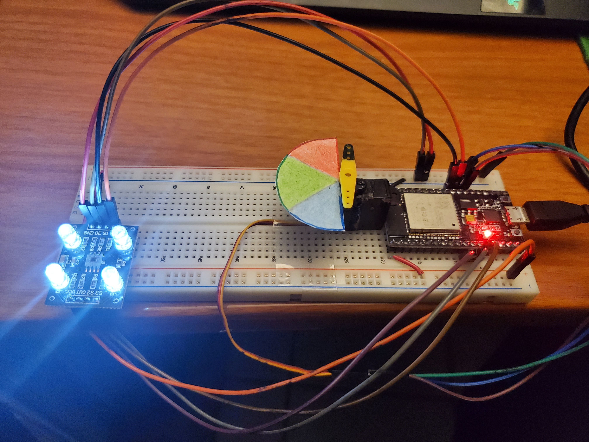
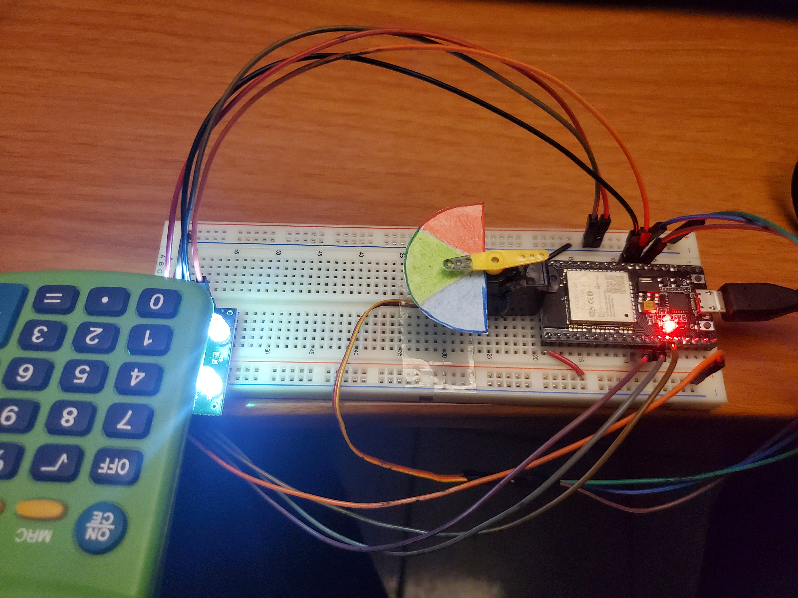
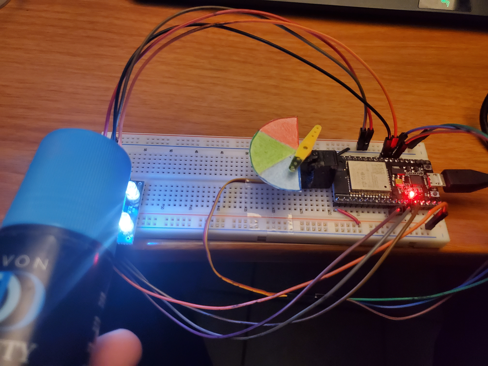
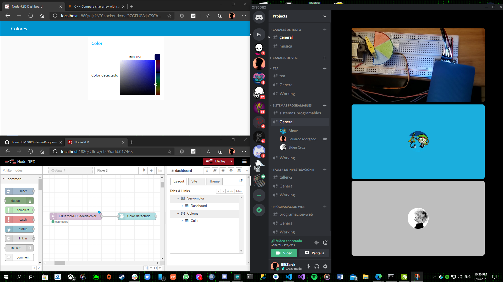
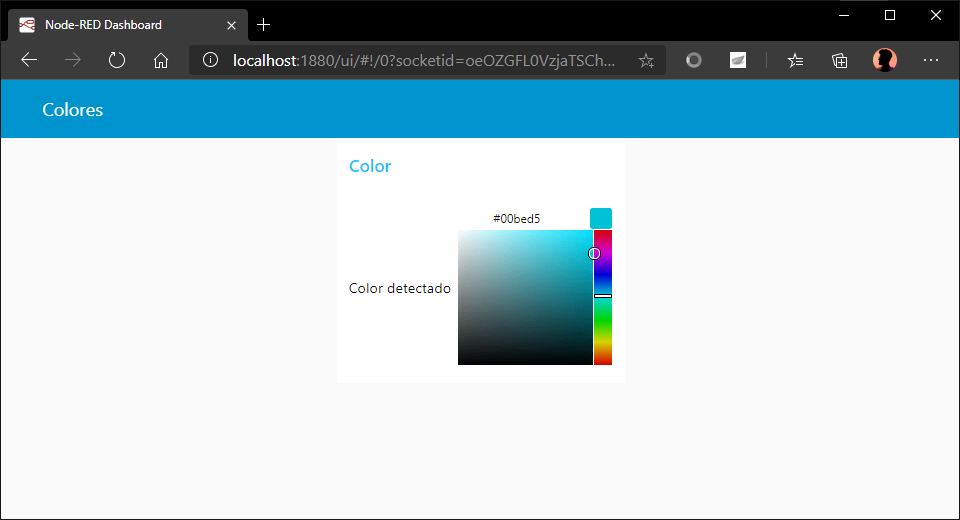
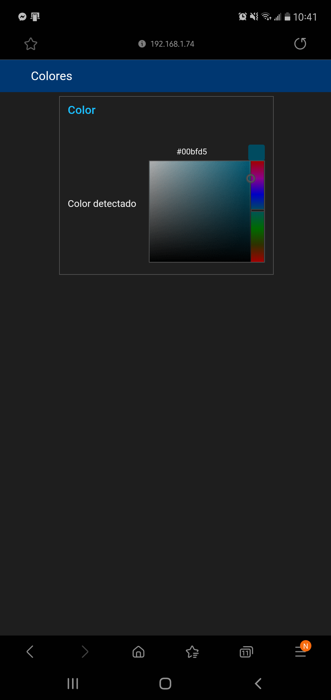

# :trophy: A5.2 Actividad de aprendizaje

Sistema sensor y actuacion del color de un objeto, e interface visual
___

## Instrucciones

- Realizar un sistema de identificacion de color utilizando un sensor de RGB TCS34725, un nodeMCU ESP32, un actuador Servomotor SG90, cualquier protocolo de comunicación y una interface visual que puede ser desarrollada por el equipo o apoyandose de otras como Node-red por ejemplo.
- Toda actividad o reto se deberá realizar utilizando el estilo **MarkDown con extension .md** y el entorno de desarrollo VSCode, debiendo ser elaborado como un documento **single page**, es decir si el documento cuanta con imágenes, enlaces o cualquier documento externo debe ser accedido desde etiquetas y enlaces, y debe ser nombrado con la nomenclatura **A5.2_NombreApellido_Equipo.pdf.**
- Es requisito que el .md contenga una etiqueta del enlace al repositorio de su documento en GITHUB, por ejemplo **Enlace a mi GitHub** y al concluir el reto se deberá subir a github.
- Desde el archivo **.md** exporte un archivo **.pdf** que deberá subirse a classroom dentro de su apartado correspondiente, sirviendo como evidencia de su entrega, ya que siendo la plataforma **oficial** aquí se recibirá la calificación de su actividad.
- Considerando que el archivo .PDF, el cual fue obtenido desde archivo .MD, ambos deben ser idénticos.
- Su repositorio ademas de que debe contar con un archivo **readme**.md dentro de su directorio raíz, con la información como datos del estudiante, equipo de trabajo, materia, carrera, datos del asesor, e incluso logotipo o imágenes, debe tener un apartado de contenidos o indice, los cuales realmente son ligas o **enlaces a sus documentos .md**, _evite utilizar texto_ para indicar enlaces internos o externo.
- Se propone una estructura tal como esta indicada abajo, sin embargo puede utilizarse cualquier otra que le apoye para organizar su repositorio.
  
```
- readme.md
  - blog
    - C5.1_TituloActividad.md
    - C5.2_TituloActividad.md    
  - img
  - docs
    - A5.1_TituloActividad.md
    - A5.2_TituloActividad.md    
```

___

## Desarrollo

1. Utilizar el siguiente listado de materiales para la elaboración de la actividad

| Cantidad | Descripción    |
| -------- | -------------- |
| 1        | [Sensor RGB TCS230](http://www.w-r-e.de/robotik/data/opt/tcs230.pdf) |
| 1 | [Servomotor SG90](http://www.ee.ic.ac.uk/pcheung/teaching/DE1_EE/stores/sg90_datasheet.pdf)  |
| 1        | Fuente de voltaje de 5V                                                                                                                               |
| 1        | [NodeMCU ESP32](https://www.amazon.com.mx/ESP-32-ESP-32S-ESP-WROOM-32-ESP32-S-desarrollo/dp/B07TBFC75Z/ref=sr_1_2?__mk_es_MX=%C3%85M%C3%85%C5%BD%C3%95%C3%91&dchild=1&keywords=esp32&qid=1599003438&sr=8-2)                |
| 1        | [BreadBoard](https://www.amazon.com.mx/Deke-Home-Breadboard-distribuci%C3%B3n-electr%C3%B3nica/dp/B086C9HK7V/ref=sr_1_22?__mk_es_MX=%C3%85M%C3%85%C5%BD%C3%95%C3%91&dchild=1&keywords=breadboard&qid=1599003455&sr=8-22)   |
| 1        | [Jumpers M/M](https://www.amazon.com.mx/ELEGOO-Macho-Hembra-Macho-Macho-Hembra-Hembra-Protoboard/dp/B06ZXSQ5WG/ref=sr_1_1?__mk_es_MX=%C3%85M%C3%85%C5%BD%C3%95%C3%91&dchild=1&keywords=jumper+wires&qid=1599003519&sr=8-1) |

2. Basado en las imágenes que se muestran en las **Figura 1**, realizar un sistema capaz de cumplir con las siguientes condiciones:
   
   - La primer fase de la actividad consistira en, al colocar un objeto frente al sensor RGB, este debera identificar que color tiene (es recomendable utiizar objetos de color Rojo, Verde, y Azul para mayor precision), el cual debera mostrar en un interface visual que color fue detectado.
   - La segunda fase, consistira en agregar un actuador que y un identificador de color apoyandose de una banda de colores como se muestra en la imagen 1; al conocer el color del objeto el actuador debera apuntar al color que se esta detectando.

 <p align="center"> 
    <strong>Figura 1 Circuito ESP32 Sensor de color y Servomotor</strong>
    
</p>

3. Coloque aquí la imagen del circuito ensamblado.






4. Coloque en este lugar el programa creado dentro del entorno de Arduino.

  #### Codigo de arduino
  ```C
  #include <Servo.h> // libreria para el servomotor
  //librerías para la conexión del broker
  #include "Adafruit_MQTT.h" 
  #include "Adafruit_MQTT_Client.h"
  #include <WiFi.h> //librería para el protocolo wifi
  //define cada pin que será utilizado por el sensor RGB
  #define S0 16
  #define S1 17
  #define S2 12
  #define S3 14
  #define OUT 27
  // Variables para guardar las frecuencias de los fotodiodos
  int frecRojo = 0;
  int frecVerde = 0;
  int frecAzul = 0;
  int colorRojo;
  int colorVerde;
  int colorAzul;
  const char* ssid = "INFINITUM2732_2.4"; //puntero de la SSID de la red
  const char* password =  "76cf6uNbpu"; //puntero de la contraseña de la red
  Servo miServo; //creación de un objeto tipo Servo
  int pos = 0; //contador para la posición del servomotor
  //define la configuración del broker
  #define HOST        "io.adafruit.com"
  #define PORT        1883
  #define USERNAME    "EduardoMJ99"
  #define PASSWORD    "---"
  WiFiClient client; //creación de objeto de tipo WiFiClient
  Adafruit_MQTT_Client mqtt(&client, HOST, PORT, USERNAME, PASSWORD);
  Adafruit_MQTT_Publish color = Adafruit_MQTT_Publish(&mqtt, USERNAME "/feeds/color");
  void MQTT_connect(); //Llamamos al método para conectar
  void setup() {
    // Definiendo las Salidas
    pinMode(S0, OUTPUT);
    pinMode(S1, OUTPUT);
    pinMode(S2, OUTPUT);
    pinMode(S3, OUTPUT);
    // Definiendo salidaSensor como entrada
    pinMode(OUT, INPUT);
    // Definiendo la escala de frecuencia a 20%
    digitalWrite(S0,HIGH);
    digitalWrite(S1,LOW);
    WiFi.mode(WIFI_STA);
    Serial.begin(115200); //inicia comunicación serial
    Serial.println("Try Connecting to "); //imprime SSID de la red
    Serial.println(ssid);
    // Inicializa conexión WiFI con la SSID y contraseña como parámetros
    WiFi.begin(ssid, password);
    while (WiFi.status() != WL_CONNECTED) {
      delay(1000); //delay por si no se establece la conexión WiFi
      Serial.print(".");
    }
    Serial.println("");
    Serial.println("WiFi connected successfully"); //mensaje de conexión exitosa
    Serial.print("Got IP: ");
    Serial.println(WiFi.localIP());  //Muestra IP del ESP32
    miServo.attach(04); //establece el pin 4 para el servomotor
  }
  void loop() {
    MQTT_connect(); //En cada iteración conectamos el MQTT
    //manda a llamar a los métodos de los 3 colores para conseguir la frecuencia y poder leer el color en cuestión
    Rojo();
    Verde();
    Azul();
    // Comprobar cuál es el color detectado y mostrarlo
    // con un mensaje en el monitor serie
    colorRojo = Conversion(colorRojo);
    colorVerde = Conversion(colorVerde);
    colorAzul = Conversion(colorAzul);
    char hex[7] = {0}; //array de caracteres para alojar el valor convertido a hexadecimal mediante los valores RGB
    sprintf(hex,"%02X%02X%02X",colorRojo,colorVerde,colorAzul);
    Serial.println(hex); //imprime el valor hexadecimal
    color.publish(hex); //pública la información al broker
    if(strcmp(hex, "000000")){ //si el valor hexadecimal es distinto a 000000
      if(colorRojo > colorVerde && colorRojo > colorAzul){ //si el valor rojo es más grande que los demás
        Serial.println(" - Detectado ROJO"); //imprime que detectó el color rojo
        miServo.write(30); //mueve el ángulo del servomotor a 30 grados
      }
      if(colorVerde > colorRojo && colorVerde > colorAzul){ //si el valor verde es más grande que los demás
        Serial.println(" - Detectado VERDE");
        miServo.write(90); //mueve el ángulo del servomotor a 90 grados
      }
      if(colorAzul > colorRojo && colorAzul > colorVerde){ //si el valor azul es más grande que los demás
        Serial.println(" - Detectado AZUL");
        miServo.write(150); //mueve el ángulo del servomotor a 150 grados
      }
    } else { // de lo contrario
      Serial.println(" - Nada detectado"); //no ha detectado ningun color
      miServo.write(0); //establece la posición del servomotor al ángulo 0
    }
    delay(1700); // se añade delay para evitar errores al publicar la información
  }
  int Conversion(int Color){ //Método para evitar valores fuera de rangos
    if(Color > 255) //cuando el valor es mayor a 255, regresamos 255
      Color = 255;
    if(Color < 0) //Cuando el valor es menor a 0, regresamos 0
      Color = 0;
    return Color;
  }
  void Rojo(){
    // Definiendo la lectura de los fotodiodos con filtro rojo
    digitalWrite(S2,LOW);
    digitalWrite(S3,LOW);
    // Leyendo la frecuencia de salida del sensor
    frecRojo = pulseIn(OUT, LOW);
    // Mapeando el valor de la frecuencia del ROJO (RED = R) de 0 a 255
    colorRojo = map(frecRojo, 100, 460, 255,0);
    // Mostrando por serie el valor para el rojo (R = Red)
    delay(100);
  }
  void Verde(){
    // Definiendo la lectura de los fotodiodos con filtro verde
    digitalWrite(S2,HIGH);
    digitalWrite(S3,HIGH);
    // Leyendo la frecuencia de salida del sensor
    frecVerde = pulseIn(OUT, LOW);
    // Mapeando el valor de la frecuencia del VERDE (GREEN = G) de 0 a 255
    colorVerde = map(frecVerde, 210, 520, 255,0);
    // Mostrando por serie el valor para el verde (G = Green)
    delay(100);
  }
  void Azul(){
    // Definiendo la lectura de los fotodiodos con filtro azul
    digitalWrite(S2,LOW);
    digitalWrite(S3,HIGH);
    // Leyendo la frecuencia de salida del sensor
    frecAzul = pulseIn(OUT, LOW);
    // Mapeando el valor de la frecuencia del AZUL (AZUL = B) de 0 a 255
    colorAzul = map(frecAzul, 98, 480, 255, 0);
    // Mostrando por serie el valor para el azul (B = Blue)
    delay(100);
  }
  void MQTT_connect() { //Método para la conexión
    int8_t ret; //definimos un byte
    if (mqtt.connected()) { //Si el mqtt está conectado, salimos del método
      return;
    }
    //Si no está conectado, intentamos conectarnos
    Serial.print("Connecting to MQTT... ");
    uint8_t retries = 3; // asignamos un valor de 3 al byte
    while ((ret = mqtt.connect()) != 0) { // mqtt.connected devuelve un 0 cuando se conecta
    //Si no se estableció la conexión, imprime el error
          Serial.println(mqtt.connectErrorString(ret));
          Serial.println("Retrying MQTT connection in 5 second..."); //Imprime mensaje
          mqtt.disconnect(); //Se desconecta para volver a intentar conectar
          delay(5000); //Esperamos 5 segundos
          retries--; //Restamos 1 al byte
          if (retries == 0){ //Cuando se han terminado las oportunidades, entonces se imprime que no fue posible
          Serial.println("No Conectado");
          while(1);
          }
    }
    Serial.println("MQTT Connected!"); //Cuando se establece la conexión, se imprime un mensaje
  }
  ```

  #### Codigo de Node-red
  ```json
  [
    {
        "id": "cf595add.017468",
        "type": "tab",
        "label": "Flow 2",
        "disabled": false,
        "info": ""
    },
    {
        "id": "9f032c67.b9efe",
        "type": "mqtt in",
        "z": "cf595add.017468",
        "name": "",
        "topic": "EduardoMJ99/feeds/color",
        "qos": "2",
        "datatype": "auto",
        "broker": "cd1b0ce1.78c2b",
        "x": 490,
        "y": 360,
        "wires": [
            [
                "45d9031c.51adcc"
            ]
        ]
    },
    {
        "id": "45d9031c.51adcc",
        "type": "ui_colour_picker",
        "z": "cf595add.017468",
        "name": "",
        "label": "Color detectado",
        "group": "6d887ae1.39fb74",
        "format": "hex",
        "outformat": "string",
        "showSwatch": true,
        "showPicker": true,
        "showValue": true,
        "showHue": true,
        "showAlpha": false,
        "showLightness": false,
        "square": "true",
        "dynOutput": "false",
        "order": 1,
        "width": "6",
        "height": "1",
        "passthru": true,
        "topic": "",
        "x": 750,
        "y": 360,
        "wires": [
            []
        ]
    },
    {
        "id": "cd1b0ce1.78c2b",
        "type": "mqtt-broker",
        "name": "Colores y Servo",
        "broker": "io.adafruit.com",
        "port": "1883",
        "clientid": "",
        "usetls": false,
        "compatmode": false,
        "keepalive": "60",
        "cleansession": true,
        "birthTopic": "",
        "birthQos": "0",
        "birthPayload": "",
        "closeTopic": "",
        "closeQos": "0",
        "closePayload": "",
        "willTopic": "",
        "willQos": "0",
        "willPayload": ""
    },
    {
        "id": "6d887ae1.39fb74",
        "type": "ui_group",
        "name": "Color",
        "tab": "9890f72c.f92bf8",
        "order": 1,
        "disp": true,
        "width": "6",
        "collapse": false
    },
    {
        "id": "9890f72c.f92bf8",
        "type": "ui_tab",
        "name": "Colores",
        "icon": "dashboard",
        "order": 2,
        "disabled": false,
        "hidden": false
    }
]
  ```

5. Coloque aquí evidencias que considere importantes durante el desarrollo de la actividad.






6. Para la demostracion de la actividad deberan utilizarse mas de un objeto para poder cubrir minimo tres colores.
7. Incluya las conclusiones individuales y resultados observados durante el desarrollo de la actividad.

- *Morgado Jacome Eduardo*
  > Para la realizacion de esta practica se deben tener conocimientos previos de multiples conceptos, tales como protocolores de comunicacion, sensores, microcontroladores, actuadores entre otros, los cuales obtuvimos durante el transcurso del semestre, por lo que como trabajo final me parece perfecto. Por lo tanto, si hubo aprendizaje de estos temas, esta practica es sencilla, pero si no, se puede complicar bastante. Desde mi punto de vista personal, un sensor RGB me es el mas interesante y divertido de usar, ya que el entender como funciona y hacer uso de este da oportunidad a una gran escalabilidad, como por ejemplo detectar objetos en funcion a su color en una banda de produccion, y hacer una determinada accion. <br> Puedo concluir que me parecio muy interesante el curso de la materia, y el hecho de que se nos enseñe que el area de programacion no esta casada a solo codificar programas para computadoras o telefonos, sino todos aquellos *sistemas programables*.

- *Perales Niebla Abner Jesus*
  > Estoy muy satisfecho con el desarrollo y el resultado de esta práctica. En primer lugar, por que ya habíamos batallado demasiado con la conexión al nodo-red en la práctica anterior, así que en esta no fue absolutamente ningún problema. Además, se nota mucho nuestro trabajo en equipo, por que ya no es necesario discutir quien hace que cosa, sino que cada quien toma una parte y se encarga de ello, ya sabemos qué tenemos que hacer y cómo hacerlo. Lo único que se "complicó" fue entender cómo realizaba las lecturas nuestro sensor, cosa que no tomó mucho tiempo, más que el probarlo y analizar su comportamiento. Sin duda, uno de los equipos más acoplados que he tenido, y el hecho de que seamos solo 3 personas facilita mucho la comunicación.

- *Cruz Vera Elden Humberto*
  > Siento que esta práctica fue bastante completa, debido a que utilizamos todos los conocimientos adquiridos durante todo el semestre. Se tuvieron un par de inconvenientes durante la realización de la practica debido a una confusión relacionada al funcionamiento del sensor RGB debido a que se tuvo que ajustar el valor de la frecuencia para el sensor. Y la última dificultad que se tuvo fue a la hora de manipular el servomotor ya que nosotros establecimos una condición utilizando el valor hexadecimal que proviene de convertir los valores RGB del sensor.

___

### :bomb: Rubrica

| Criterios     | Descripción                                                                                  | Puntaje |
| ------------- | -------------------------------------------------------------------------------------------- | ------- |
| Instrucciones | Se cumple con cada uno de los puntos indicados dentro del apartado Instrucciones?            | 10      |
| Desarrollo    | Se respondió a cada uno de los puntos solicitados dentro del desarrollo de la actividad?     | 60      |
| Demostración  | El alumno se presenta durante la explicación de la funcionalidad de la actividad?            | 20      |
| Conclusiones  | Se incluye una opinión personal de la actividad  por cada uno de los integrantes del equipo? | 10      |

:house: [Ir a inicio](../readme.md)

##### :open_file_folder: [Repositorio de Github de Morgado Jacome Eduardo](https://github.com/EduardoMJ99/SistemasProgramables_2020-2.git) :open_file_folder:
##### :open_file_folder: [Repositorio de Github de Cruz Vera Elden Humberto](https://github.com/CruzVeraEldenHumberto/Sistemas-Programables) :open_file_folder:
##### :open_file_folder: [Repositorio de Github de Perales Niebla Abner Jesús](https://github.com/AbnerPerales19/SistemasProgramables_AbnerPerales.git) :open_file_folder: