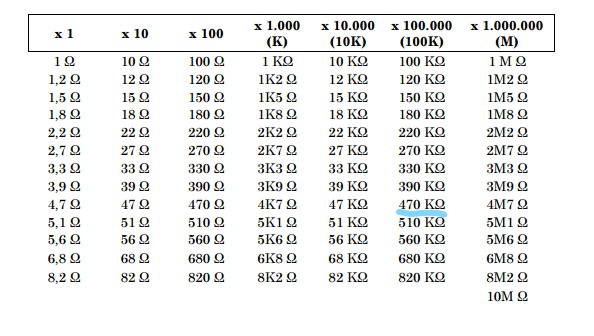

# Actuadores

## :trophy: C2.3 Reto en clase

**Circuito temporizador con circuito NE555**

### :blue_book: Instrucciones

- De acuerdo con la información presentada por el asesor referente al tema, elabore lo que se solicita dentro del apartado desarrollo.
- Toda actividad o reto se deberá realizar utilizando el estilo **MarkDown con extension .md** y el entorno de desarrollo VSCode, debiendo ser elaborado como un documento **single page**, es decir si el documento cuanta con imágenes, enlaces o cualquier documento externo debe ser accedido desde etiquetas y enlaces.
- Es requisito que el archivo .md contenga una etiqueta del enlace al repositorio de su documento en Github, por ejemplo **Enlace a mi GitHub**
- Al concluir el reto el reto se deberá subir a github el archivo .md creado.
- Desde el archivo **.md** se debe exportar un archivo **.pdf** con la nomenclatura **C2.3_NombreAlumno_Equipo.pdf**, el cual deberá subirse a classroom dentro de su apartado correspondiente, para que sirva como evidencia de su entrega; siendo esta plataforma **oficial** aquí se recibirá la calificación de su actividad por individual.
- Considerando que el archivo .pdf, fue obtenido desde archivo .md, ambos deben ser idénticos y mostrar el mismo contenido.
- Su repositorio ademas de que debe contar con un archivo **readme**.md dentro de su directorio raíz, con la información como datos del estudiante, equipo de trabajo, materia, carrera, datos del asesor, e incluso logotipo o imágenes, debe tener un apartado de contenidos o indice, los cuales realmente son ligas o **enlaces a sus documentos .md**, _evite utilizar texto_ para indicar enlaces internos o externo.
- Se propone una estructura tal como esta indicada abajo, sin embargo puede utilizarse cualquier otra que le apoye para organizar su repositorio.  
``` 
| readme.md
| | blog
| | | C2.1_x.md
| | | C2.2_x.md
| | | C2.3_x.md
| | img
| | docs
| | | A2.1_x.md
| | | A2.2_x.md
```

## :pencil2: Desarrollo

1. Investigue que es la modulación por ancho de pulso y para que sirve.
   
    La modulación por ancho de pulsos de una señal o fuente de energía es una técnica en la que se modifica el ciclo de trabajo de una señal periódica (una senoidal o una cuadrada, por ejemplo), ya sea para transmitir información a través de un canal de comunicaciones o para controlar la cantidad de energía que se envía a una carga.

2. Calcule el valor de C y R para obtener un valor de señal de 5 segundos para el siguiente circuito temporizador mono-estable.
   
      Valor R | Valor C |
    ---------|----------|
    470KΩ  | 10µF |

    Se realizó del despeje de esta formula: Ct = 1.1 * R * C

    Ct/1.1 = R * C

    5s/1.1 = R * C

    4.54s = R * C

    Como se puede observar, se tiene que encontrar una resistencia y un capacitor que multiplicados den 4.54. 
     
    

    

    Observando las tablas anteriores de resistencias y capacitores comerciales los componentes que más se acercan a la cantidad deseada es una resistencia de 470KΩ y el capacitor de 10µF, ya que al multiplicarlos obtenemos 4.7s.

    Si los reemplazamos en la formula:

    Ct = 1.1 * 470KΩ * 10µF

    Ct = 5.17s

3. Como se podrá observar la imagen anexa corresponde a un circuito temporizador,que terminal se tendría que utilizar para activar el temporizador? Cual terminal se utilizaría si se desea integrar un actuador eléctrico?


<p align="center">
    
</p>


### :bomb: Rubrica

| Criterios     | Descripción                                                                                  | Puntaje |
| ------------- | -------------------------------------------------------------------------------------------- | ------- |
| Instrucciones | Se cumple con cada uno de los puntos indicados dentro del apartado Instrucciones?            | 20 |
| Desarrollo    | Se respondió a cada uno de los puntos solicitados dentro del desarrollo de la actividad?     | 80      |

[Mi repositorio de Github](https://github.com/CruzVeraEldenHumberto/Sistemas-Programables)