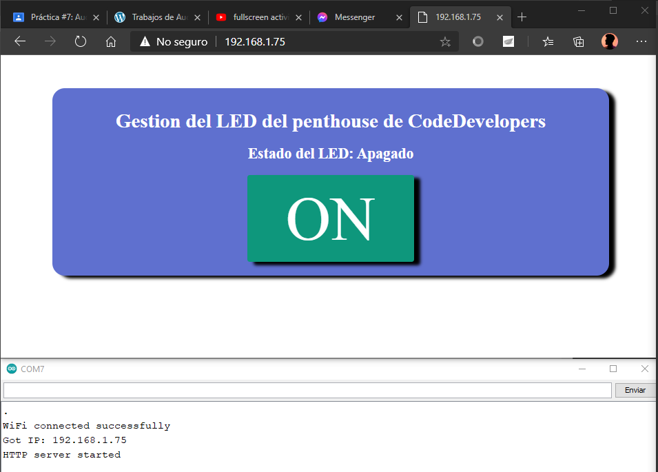
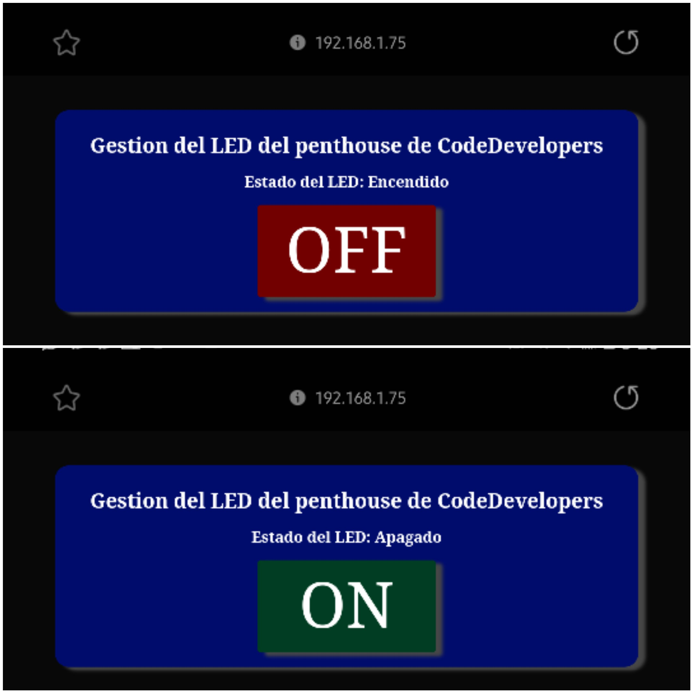

# :trophy: C4.2 Programación Microcontrolador NodeMCU ESP32

Comunicación por medio de la conexión Wi-Fi

___

## :blue_book: Instrucciones

- De acuerdo con la información presentada por el asesor referente al tema, desarrollar lo que se indica dentro del apartado siguiente.
- Toda actividad o reto se deberá realizar utilizando el estilo **MarkDown con extension .md** y el entorno de desarrollo VSCode, debiendo ser elaborado como un documento **single page**, es decir si el documento cuanta con imágenes, enlaces o cualquier documento externo debe ser accedido desde etiquetas y enlaces.
- Es requisito que el archivo .md contenga una etiqueta del enlace al repositorio de su documento en Github, por ejemplo **Enlace a mi GitHub**
- Al concluir el reto el reto se deberá subir a github el archivo .md creado.
- Desde el archivo **.md** se debe exportar un archivo **.pdf** con la nomenclatura **C4.2_NombreAlumno_Equipo.pdf**, el cual deberá subirse a classroom dentro de su apartado correspondiente, para que sirva como evidencia de su entrega; siendo esta plataforma **oficial** aquí se recibirá la calificación de su actividad por individual.
- Considerando que el archivo .pdf, fue obtenido desde archivo .md, ambos deben ser idénticos y mostrar el mismo contenido.
- Su repositorio ademas de que debe contar con un archivo **readme**.md dentro de su directorio raíz, con la información como datos del estudiante, equipo de trabajo, materia, carrera, datos del asesor, e incluso logotipo o imágenes, debe tener un apartado de contenidos o indice, los cuales realmente son ligas o **enlaces a sus documentos .md**, _evite utilizar texto_ para indicar enlaces internos o externo.
- Se propone una estructura tal como esta indicada abajo, sin embargo puede utilizarse cualquier otra que le apoye para organizar su repositorio.  


``` 
| readme.md
| | blog
| | | C4.1_TituloActividad.md
| | | C4.2_TituloActividad.md
| | | C4.3_TituloActividad.md
| | | C4.4_TituloActividad.md
| | | C4.5_TituloActividad.md
| | img
| | docs
| | | A4.1_TituloActividad.md
| | | A4.2_TituloActividad.md
```
___

## :pencil2: Desarrollo

1. Basado en el siguiente circuito, ensamblarlo, utilizando los elementos electrónicos observados.

<p align="center">
    
</p>

Fuente de consulta: [Random Nerd Tutorials]()

2. Analice y apóyese del programa que se muestra a continuación para elaborar el reto.

```C++
/*
 WiFi Web Server Simple
 */

#include <WiFi.h>
#include <WebServer.h>

const char* ssid = "<identificador>";
const char* password =  "<password>";

WebServer server(80);  // Object of WebServer(HTTP port, 80 is defult)

void setup() {
  Serial.begin(115200);
  Serial.println("Try Connecting to ");
  Serial.println(ssid);

  // Connect to your wi-fi modem
  WiFi.begin(ssid, password);

  // Check wi-fi is connected to wi-fi network
  while (WiFi.status() != WL_CONNECTED) {
  delay(1000);
  Serial.print(".");
  }
  Serial.println("");
  Serial.println("WiFi connected successfully");
  Serial.print("Got IP: ");
  Serial.println(WiFi.localIP());  //Show ESP32 IP on serial

  server.on("/", handle_root);

  server.begin();
  Serial.println("HTTP server started");
  delay(100); 
}

void loop() {
  server.handleClient();
}

// HTML & CSS contents which display on web server
String HTML = "<!DOCTYPE html>\
<html>\
<body>\
<h1>Mi Primer Servidor Web with ESP32 - Station Mode &#128522;</h1>\
</body>\
</html>";

// Handle root url (/)
void handle_root() {
  server.send(200, "text/html", HTML);
}
```

3. Pruebe y observe los resultados obtenidos explicándolos en esta sección.
   > Se puede apreciar una página web con el título Mi Primer Servidor Web with ESP32 - Station Mode, la cual se pudo acceder a ella mediante la conexión de un dispositivo con un servidor web apoyandose del ESP32. <br> En el punto 4, simplemente se agregó un botón para poder manipular un led mediante la conexión establecida anteriormente.
   

4. Al programa anterior agregue las instrucciones necesarias para que se despliegue en la interface un botón que permita encender y apagar un Led tal como se muestra en la figura 1.

  ```C
  /*
  WiFi Web Server Simple
  */
  #include <WiFi.h>
  #include <WebServer.h>

  const char* ssid = "INFINITUM2732_2.4";
  const char* password =  "76cf6uNbpu";

  int LEDpin = 16;
  bool LEDstatus = LOW;
  int freq = 5000;
  int ledCanal = 0;
  int resolucion = 8;

  WebServer server(80);  // Object of WebServer(HTTP port, 80 is defult)

  void setup() {
    Serial.begin(115200);
    Serial.println("Try Connecting to ");
    Serial.println(ssid);
    pinMode(LEDpin, OUTPUT);
    ledcSetup(ledCanal, freq, resolucion);
    ledcAttachPin(LEDpin, ledCanal);

    // Connect to your wi-fi modem
    WiFi.begin(ssid, password);

    // Check wi-fi is connected to wi-fi network
    while (WiFi.status() != WL_CONNECTED) {
    delay(1000);
    Serial.print(".");
    }
    Serial.println("");
    Serial.println("WiFi connected successfully");
    Serial.print("Got IP: ");
    Serial.println(WiFi.localIP());  //Show ESP32 IP on serial

    server.on("/", handle_root);
    server.on("/ledON", handle_ledon);
    server.on("/ledOFF", handle_ledoff);

    server.begin();
    Serial.println("HTTP server started");
    delay(100); 
  }

  void loop() {
    server.handleClient();
    if(LEDstatus){
      ledcWrite(ledCanal, 255);
    }
    else{
      ledcWrite(ledCanal, 0);
    }
  }

  // HTML & CSS contents which display on web server
  String HTML(uint8_t ledStatus) {
    String texto = "<!DOCTYPE html>\
    <html>\
    <style> \
    .center {text-align:center;} \
    .button {display: block;background-color: #48d056;border: none;color: white;padding: 13px 30px;text-decoration: none;font-size: 100px;margin: 1% auto 1%;cursor: pointer;border-radius: 4px;}\
    .button-on {background-color: #c23636;}\
    .button-on:active {background-color: #c77676;}\
    .button-off {background-color: #0e977c;}\
    .button-off:active {background-color: #629e92;}\
    body{margin-top: 5%; }\
    a {width: 25%; box-shadow: 10px 5px 5px black; margin: 10% auto;}\
    h1 {color: #ffffff; } \
    h2 {color: #ffffff; }\
    div {box-shadow: 10px 5px 5px black;  margin: 10px auto 20px; max-width: 100%;  width: 80%; background-color: #5f70cf;  padding: 13px 30px; border-radius: 20px;}\
    </style>\
    <body class=\"center\">\
    <div>\
    <h1> Gestion del LED del penthouse de CodeDevelopers </h1>";

    if(ledStatus){
      texto += "<h2> Estado del LED: Encendido </h2><a href=\"/ledOFF\"  class=\"button button-on\"> OFF </a>";
    }
    else{
      texto += "<h2> Estado del LED: Apagado </h2><a href=\"/ledON\" class=\"button button-off\"> ON </a>";
    }

    texto += "</div></body></html>";
    return texto;
  }


  // Handle root url (/)
  void handle_root() {
    server.send(200, "text/html", HTML(false));
  }

  void handle_ledon() {
    LEDstatus = HIGH;
    Serial.println("Metodo encender");
    server.send(200, "text/html", HTML(LEDstatus)); 
  }

  void handle_ledoff() {
    LEDstatus = LOW;
    Serial.println("Metodo apagar");
    server.send(200, "text/html", HTML(LEDstatus)); 
  }
  ```

5. Inserte aquí las imágenes que considere como evidencias para demostrar el resultado obtenido.





### Desde el telefono



___

### :bomb: Rubrica

| Criterios     | Descripción                                                                                  | Puntaje |
| ------------- | -------------------------------------------------------------------------------------------- | ------- |
| Instrucciones | Se cumple con cada uno de los puntos indicados dentro del apartado Instrucciones?            | 20 |
| Desarrollo    | Se respondió a cada uno de los puntos solicitados dentro del desarrollo de la actividad?     | 80      |

:house: [Ir a inicio](../readme.md)

##### :open_file_folder: [Repositorio de Github de Morgado Jacome Eduardo](https://github.com/EduardoMJ99/SistemasProgramables_2020-2.git) :open_file_folder:
##### :open_file_folder: [Repositorio de Github de Cruz Vera Elden Humberto](https://github.com/CruzVeraEldenHumberto/Sistemas-Programables) :open_file_folder:
##### :open_file_folder: [Repositorio de Github de Perales Niebla Abner Jesús](https://github.com/AbnerPerales19/SistemasProgramables_AbnerPerales.git) :open_file_folder: