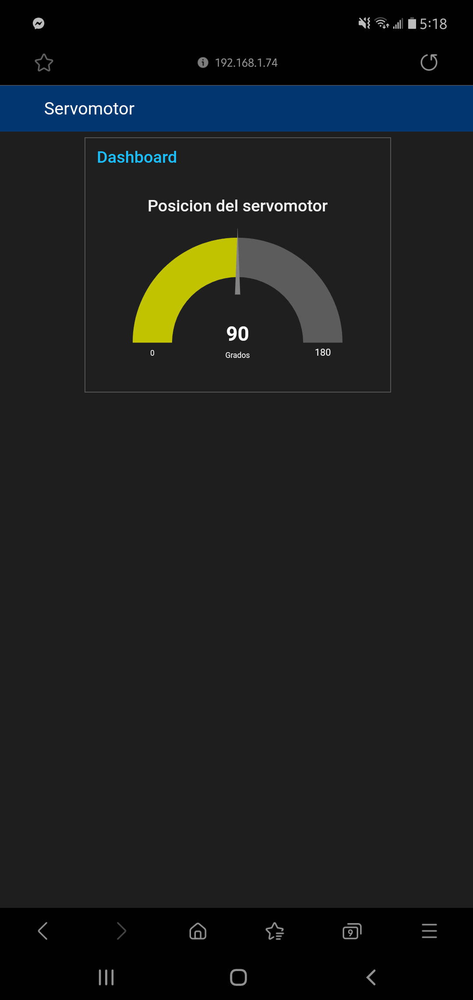

# :trophy: C5.2 Interface Node-RED y NodeMCU ESP32

Arquitectura Cliente-Servidor, utilizando interface Node-red, ESP32 y un actuador
___

## :blue_book: Instrucciones

- De acuerdo con la información presentada por el asesor referente al tema, desarrollar lo que se indica dentro del apartado siguiente.
- Toda actividad o reto se deberá realizar utilizando el estilo **MarkDown con extension .md** y el entorno de desarrollo VSCode, debiendo ser elaborado como un documento **single page**, es decir si el documento cuanta con imágenes, enlaces o cualquier documento externo debe ser accedido desde etiquetas y enlaces.
- Es requisito que el archivo .md contenga una etiqueta del enlace al repositorio de su documento en Github, por ejemplo **Enlace a mi GitHub**
- Al concluir el reto el reto se deberá subir a github el archivo .md creado.
- Desde el archivo **.md** se debe exportar un archivo **.pdf** con la nomenclatura **C5.2_NombreAlumno_Equipo.pdf**, el cual deberá subirse a classroom dentro de su apartado correspondiente, para que sirva como evidencia de su entrega; siendo esta plataforma **oficial** aquí se recibirá la calificación de su actividad por individual.
- Considerando que el archivo .pdf, fue obtenido desde archivo .md, ambos deben ser idénticos y mostrar el mismo contenido.
- Su repositorio ademas de que debe contar con un archivo **readme**.md dentro de su directorio raíz, con la información como datos del estudiante, equipo de trabajo, materia, carrera, datos del asesor, e incluso logotipo o imágenes, debe tener un apartado de contenidos o indice, los cuales realmente son ligas o **enlaces a sus documentos .md**, _evite utilizar texto_ para indicar enlaces internos o externo.
- Se propone una estructura tal como esta indicada abajo, sin embargo puede utilizarse cualquier otra que le apoye para organizar su repositorio.  


``` 
| readme.md
| | blog
| | | C5.1_TituloActividad.md
| | | C5.2_TituloActividad.md
| | img
| | docs
| | | A5.1_TituloActividad.md
| | | A5.2_TituloActividad.md
```
___

## :pencil2: Desarrollo

1. Basado en las actividades referentes a actuadores, y protocolos de comunicación realice un Dashboard utilizando la interface Node-red y el NodeMCU ESP32; el cual permitirá a un cliente a través de su dispositivo movil acceder a una dirección de un servidor Web local, y al ingresar al sitio deberá poder interactuar y visualizar el comportamiento de un actuador en tiempo real.

2. Para poder observar que la interface muestra el comportamiento del actuador deberá a este someterse a condiciones cambiantes a fin de observar esas variaciones en la interface.

3. Agregue el programa creado para lograr la condición solicitada.

    ```C
    #include <Servo.h> //libreria para el servomotor
    //librerías para el broker
    #include "Adafruit_MQTT.h"
    #include "Adafruit_MQTT_Client.h"
    #include <WiFi.h> //librería para conexión WIFI
    const char* ssid = "INFINITUM2732_2.4"; //puntero que indica la SSID de la red
    const char* password =  "76cf6uNbpu"; //puntero que indica la contraseña de la red
    Servo miServo; //objeto de tipo Servo
    int pos = 0; //variable contador para indicar la posición del servomotor
    //Aquí se define información necesaria para el broker
    #define HOST        "io.adafruit.com"
    #define PORT        1883
    #define USERNAME    "EduardoMJ99"
    #define PASSWORD    "aio_DZPC32ZKfzr8Y5XgK3yd0MzvqIgf"
    WiFiClient client; //objeto de tipo WiFiClient
    Adafruit_MQTT_Client mqtt(&client, HOST, PORT, USERNAME, PASSWORD);
    Adafruit_MQTT_Publish pos_servo = Adafruit_MQTT_Publish(&mqtt, USERNAME "/feeds/pos_servo");
    void MQTT_connect(); //Realizamos la conexión con el broker
    void setup() {
    WiFi.mode(WIFI_STA);
    Serial.begin(115200); //inicia comunicación serial
    Serial.println("Try Connecting to "); //mensaje que indica que se intenta comunicar a una red con la siguiente SSID
    Serial.println(ssid);
    // Connect to your wi-fi modem
    WiFi.begin(ssid, password); //inicia comunicación por WiFi
    while (WiFi.status() != WL_CONNECTED) { //mientras no haya comunicación por Wifi añade un delay
        delay(1000);
        Serial.print(".");
    }
    Serial.println("");
    Serial.println("WiFi connected successfully"); //mensaje que indica que se conectó exitosamente y que se obtuvo una IP
    Serial.print("Got IP: ");
    Serial.println(WiFi.localIP());  //Muestra IP del ESP32
    miServo.attach(04); //asigna el pin 4 para el servo
    }
    void loop() {
    MQTT_connect(); //inicia la conexión al broker
    for (pos = 0; pos<=180; pos+=10) { //ciclo For que manipula la posición del servomotor 
        miServo.write(pos); //cambia el ángulo del servomotor mediante el contador pos
        pos_servo.publish(pos); //pública la información del ángulo actual
        delay(2000); //delay de 2 segundos debido a las limitaciones de la página
    }
    for(pos = 180; pos >= 0; pos -= 10) { //ciclo For que manipula la posición del servomotor para que realice una rotación inverso
        miServo.write(pos); //cambia el ángulo del servomotor mediante el contador pos
        pos_servo.publish(pos); //pública la información del ángulo actual
        delay(2000); //delay de 2 segundos debido a las limitaciones de la página
    }
    }
    void MQTT_connect() { //Este es el método de conexión con el broker
    int8_t ret;
    if (mqtt.connected()) { //Mientras el broker esté conectado, el trabajo aquí está hecho
        return;
    }
    //Cuando no está conectado, entonces iniciamos la conexión
    Serial.print("Connecting to MQTT... ");
    uint8_t retries = 3; //byte
    //mqtt.connect() devuelve 0 se conecta
    while ((ret = mqtt.connect()) != 0) { //  En caso de que no se conecte
        //Mostramos el error por el cual no está conectado
        Serial.println(mqtt.connectErrorString(ret)); 
        Serial.println("Retrying MQTT connection in 5 second...");
        mqtt.disconnect(); //Desconectamos el broker
        delay(5000); //Esperamos 5 segundos
        retries--; //Disminuimos el valor del byte
        if (retries == 0){
            Serial.println("No Conectado"); //Desplegamos el mensaje de que no se pudo establecer la conexión
            while(1);
        }
    }
    Serial.println("MQTT Connected!"); //Si se pudo restablecer la conexión
    }
    ```

4. Agregue imágenes del circuito electrónico ensamblado.


5. Inserte aquí las imágenes que considere como evidencias para demostrar el resultado obtenido y las reuniones del equipo de trabajo.




___

### :bomb: Rubrica

| Criterios     | Descripción                                                                                  | Puntaje |
| ------------- | -------------------------------------------------------------------------------------------- | ------- |
| Instrucciones | Se cumple con cada uno de los puntos indicados dentro del apartado Instrucciones?            | 20 |
| Desarrollo    | Se respondió a cada uno de los puntos solicitados dentro del desarrollo de la actividad?     | 80      |

:house: [Ir a inicio](../readme.md)

##### :open_file_folder: [Repositorio de Github de Morgado Jacome Eduardo](https://github.com/EduardoMJ99/SistemasProgramables_2020-2.git) :open_file_folder:
##### :open_file_folder: [Repositorio de Github de Cruz Vera Elden Humberto](https://github.com/CruzVeraEldenHumberto/Sistemas-Programables) :open_file_folder:
##### :open_file_folder: [Repositorio de Github de Perales Niebla Abner Jesús](https://github.com/AbnerPerales19/SistemasProgramables_AbnerPerales.git) :open_file_folder: